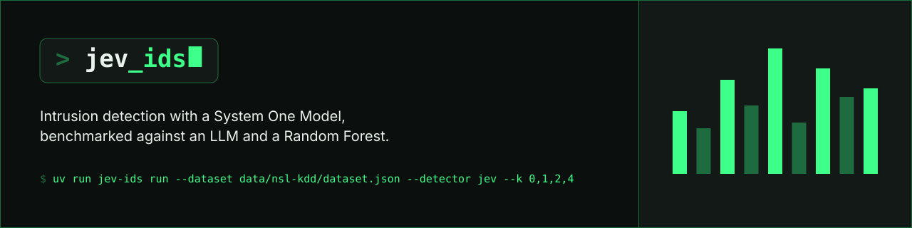
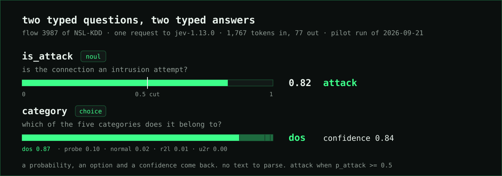
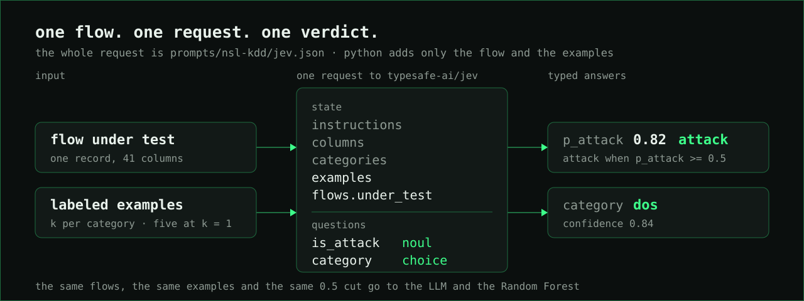

# Jev IDS

    

**Intrusion detection in one request. Show [TypeSafe's Jev](https://docs.typesafe.ai/introduction) one network flow and five labeled examples. It answers whether the flow is an attack and which kind, in half a second, with no text to parse.**

Jev IDS was tested on NSL-KDD, a reference benchmark of the cybersecurity community, against a state-of-the-art LLM (GPT-5.6 Luna) and a classic machine-learning model (Random Forest). Given the same five examples, Jev IDS was:

- **4.8× faster** than the LLM.
- **3.8× cheaper** than the LLM.
- **1.5× better at catching zero-day attacks** than the LLM.
- **15× fewer false alarms** than the Random Forest.

The numbers and their limits are in [Evidence and limits](#evidence-and-limits).

[Read the loop](jev_ids/run.py) · [The request template](prompts/nsl-kdd/jev.json) · [Glossary](CONTEXT.md)

## How it works

Jev is a System One Model. Instead of writing text, it reads a `state` and answers typed questions about it with probabilities. Jev IDS puts one flow into the state, next to the instructions, the column names, the five category descriptions and the labeled examples, and asks two questions. `is_attack` comes back as a probability. `category` comes back as one of five options with a confidence. The verdict is attack when the probability reaches 0.5.



Every request follows the same path:



The whole request is one file, [`prompts/nsl-kdd/jev.json`](prompts/nsl-kdd/jev.json). Python adds only the flow and the examples, and the file's sha256 travels in every prediction row as `prompt_hash`, so runs that asked different things are never compared as equals. Examples are labeled by category only: attack names such as `neptune` never reach a model.

The same flows, examples and 0.5 cut go to two baselines: an LLM through an Agno agent with a JSON output schema (GPT-5.6 through the ChatGPT Codex backend, or DeepSeek) and a scikit-learn Random Forest trained on the same examples. A third baseline, an Isolation Forest fitted on the benign flows of the pool alone, never sees an example: it is the unsupervised reference, at k = all only.

## Try it

```bash
git clone https://github.com/jev-ids/jev-ids.git
cd jev-ids
uv sync
# .env: TYPESAFE_API_KEY for Jev; DEEPSEEK_API_KEY and CHATGPT_CLIENT_ID only for the LLM baselines.
```

Download [NSL-KDD](https://www.kaggle.com/datasets/hassan06/nslkdd) into `data/raw/nsl-kdd/` and prepare it once:

```bash
uv run python -m scripts.prepare_nsl_kdd
uv run jev-ids run --dataset data/nsl-kdd/dataset.json --detector jev --split smoke --k 0,1
```

The smoke split is five flows. The run writes `results/<timestamp>-nsl-kdd-jev-smoke/` with `config.json`, one JSON row per flow in `predictions.jsonl` (the verdict, the truth, p_attack, the category, the confidence, the latency and the gateway's token report) and the raw answers in `responses.jsonl`.

## Compare detectors

```bash
uv run jev-ids run --dataset data/nsl-kdd/dataset.json --detector jev --split pilot --k 0,1,2,4,8,16 --seeds 0,1,2
uv run jev-ids run --dataset data/nsl-kdd/dataset.json --detector llm:openai --model gpt-5.6-luna --split pilot --k 0,1,2,4,8,16
uv run jev-ids run --dataset data/nsl-kdd/dataset.json --detector random_forest --split pilot --k 1,2,4,8,16,all
uv run jev-ids metrics results/<run_id> [results/<run_id> ...] > results/summary.csv
uv run jev-ids compare results/<jev_run> results/<rf_run> --subset novel --k-a 0 --k-b all
```

k is the number of labeled examples per category. k = 1 with five categories means five examples, and `all` means the whole pool. `metrics` prints one CSV row per detector and k with F1, recall on novel attacks, tokens, latency and cost. `compare` pairs two runs flow by flow and runs McNemar's test on the discordant pairs, because only the flows two detectors disagree on tell them apart. Cost is computed offline as tokens times the list prices in [`prices.json`](prices.json), for every detector alike.

## Why it is fast and cheap

- **One request, two answers.** Both questions run over the same state and come back as a probability, an option and a confidence. Nothing to parse, no schema to enforce.
- **Input only.** Jev charges $0.042 per million input tokens and nothing for output. At about 1,800 tokens per flow, a million verdicts cost about $74.
- **The prompt is a file.** Its sha256 rides in every row, so runs with different prompts are never compared as equals.
- **Flows in the innermost loop.** The prompt prefix stays constant as long as possible, so provider caches get their best chance.
- **Fail open.** A failed call becomes a row with `error`, counted as no alert. Never a crash.
- **Same cut for everyone.** p_attack ≥ 0.5 decides for Jev, the LLM and the forest. No per-detector tuning.

## Small enough to read

| File                                                                   | Job                                                                        |
| ---------------------------------------------------------------------- | -------------------------------------------------------------------------- |
| [cli.py](jev_ids/cli.py)                                               | `run`, `metrics` and `compare`                                             |
| [dataset.py](jev_ids/dataset.py)                                       | The card, the pool, the splits and the k-shot example draw                 |
| [run.py](jev_ids/run.py)                                               | The loop, cell by cell and flow by flow, and the three files of a run      |
| [records.py](jev_ids/records.py)                                       | One prediction row and its JSONL                                           |
| [metrics.py](jev_ids/metrics.py)                                       | F1, novel recall, tokens, cost, latency, and the paired comparison         |
| [detectors/jev.py](jev_ids/detectors/jev.py)                           | Jev through TypeSafe's API, one flow per request                           |
| [detectors/llm.py](jev_ids/detectors/llm.py)                           | The LLM baselines through Agno                                             |
| [detectors/random_forest.py](jev_ids/detectors/random_forest.py)       | The classical baseline                                                     |
| [detectors/isolation_forest.py](jev_ids/detectors/isolation_forest.py) | The unsupervised baseline, fitted on benign traffic alone                  |
| [prompts/nsl-kdd/](prompts/nsl-kdd)                                    | `jev.json`, the whole request template; `llm.md`, the agent's instructions |

## Evidence and limits

Pilot split of NSL-KDD: 300 flows, 160 of them attacks and 39 of those of a kind absent from KDDTrain+. Three seeds of examples, so 900 predictions per detector and k. Means over the three seeds, from the runs of 2026-09-21.

| Detector                  | k   | F1        | Precision | Recall | Novel-attack recall | Latency  | Cost per 1M flows |
| ------------------------- | --- | --------- | --------- | ------ | ------------------- | -------- | ----------------- |
| Jev (`typesafe-ai/jev`)   | 1   | **0.859** | 0.941     | 0.790  | **0.838**           | 504 ms   | $74               |
| GPT-5.6 (`gpt-5.6-luna`)  | 1   | 0.776     | 0.914     | 0.675  | 0.547               | 2,410 ms | $283              |
| Random Forest (100 trees) | 1   | 0.728     | 0.574     | 1.000  | 1.000               | 3 ms     | local             |
| Jev                       | 2   | 0.839     | 0.929     | 0.765  | 0.761               | 494 ms   | $106              |
| GPT-5.6                   | 2   | 0.807     | 0.930     | 0.715  | 0.573               | 2,476 ms | $399              |
| Random Forest             | 2   | 0.766     | 0.629     | 0.990  | 0.991               | 2 ms     | local             |

Jev against the Random Forest at k = 1: of 900 paired verdicts, 439 differ. Jev is right in 338 of them and the forest in 101 (McNemar p ≈ 6 × 10⁻³¹). A forest trained on five rows calls almost everything an attack, which is why its recall is perfect and its precision is not.

The four multipliers at the top come from the k = 1 rows: 2,410 ms against 504 ms per flow, $283 against $74 per million flows, 55% against 84% of novel attacks caught (attacks of a kind absent from the examples), and 362 against 24 false alarms on the same 420 benign flows.

Limits worth knowing:

- These are pilot numbers, taken to settle the protocol. The reported results will come from the disjoint `paper` split with k up to 16. NF-UQ-NIDS-v2 has a card and a preparation script and no run yet.
- Latency is the wall clock around the successful HTTP call, measured from the client. The pilot ran through the Vercel AI Gateway, which rate-limited often: 1,350 of the 1,800 Jev rows needed at least one retry, and the retries are not in the latency. The code now calls TypeSafe's API directly.
- Cost is tokens times list prices, not what was billed. Jev was free under a promotion until 2026-09-25, and GPT-5.6 ran through the ChatGPT Codex backend, priced here at the public API list rate.
- The gateway masked Jev's version in the pilot (it reports `typesafe-ai/jev`). Since 2026-09-21 the request names `jev-1.13.0` and every row records the version that answered.
- Jev's `noul` answer carries no confidence. Only the `choice` answer does.

## Development

```bash
make check
```

Python 3.13+. The gate runs ruff with Google-style docstring rules, complexipy, pyright in strict mode, pytest with coverage, vulture, pip-audit and jscpd. Thresholds live in `pyproject.toml` and `.jscpd.json`. Runs make paid API calls and write only under `results/`.

## Bring your own flows

Jev IDS is an independent research prototype, not a product. Its numbers come from one pilot on NSL-KDD, and it is not affiliated with TypeSafe. It can still sit inside a commercial solution, and this is how.

### Where Jev fits

A commercial IDS already has sensors, a flow exporter and a signature engine feeding a SIEM. Jev IDS replaces none of them. It sits beside the pipeline, off the packet path, and judges one flow record at a time:

- **Second opinion on alerts.** Send Jev the flow behind each alert the signature engine raised. `p_attack` ranks the queue, and the SOC reads the top first. In the pilot, Jev raised 24 false alarms on 420 benign flows where a Random Forest raised 362.
- **A net behind the signatures.** Signatures miss what they have never seen. Sample the flows the engine passed as clean, or every flow to a critical asset, and let Jev judge them: it caught 84% of attacks of a kind absent from its examples.
- **A category for the playbook.** The `choice` answer names the category with a confidence, so the SIEM routes dos, probe, r2l and u2r, or your own taxonomy, to different runbooks with no parser in between.
- **Coverage from day one.** A new site or tenant has no training set. Jev needs one labeled flow per category, so it covers the segment while a classical model is still collecting data.

Half a second per verdict and a rate-limited API make this an asynchronous side channel, fed from the exporter (NetFlow, IPFIX, Zeek `conn.log`) through a queue, never an inline filter.

### Six steps

1. **Get a key.** Jev is served by TypeSafe; set `TYPESAFE_API_KEY` in `.env`. Pricing and terms are TypeSafe's.
2. **Describe your flows.** Write a dataset card like [`data/nsl-kdd/dataset.json`](data/nsl-kdd/dataset.json): the columns your flow exporter emits, in order, which of them are symbolic, your categories and which one is benign.
3. **Write the request.** Copy [`prompts/nsl-kdd/jev.json`](prompts/nsl-kdd/jev.json), replace `columns` and the category descriptions with yours, and keep the two questions.
4. **Pick examples.** One labeled flow per category from your own network is enough to start; k = 1 is what the pilot used.
5. **Call the detector.** `JevDetector(load_prompt(path)).predict(flow, examples)` returns `p_attack`, `category_pred` and `confidence` for one flow in about half a second. Route `p_attack` to your alerting with the cut your alarm budget allows; 0.5 was the benchmark's choice, not a rule.
6. **Measure before you trust.** Run `jev-ids run` and `jev-ids metrics` on a labeled split of your own flows. The numbers above are NSL-KDD's, not yours.

Only flow features leave your network, never payloads, but they do leave it: every request goes to TypeSafe's API.

## Team

<table align="center">
  <tr>
    <td align="center" width="220">
      <a href="https://github.com/paulosevero"></a><br />
      <b>Paulo Severo</b><br />
      <a href="https://github.com/paulosevero"><code>@paulosevero</code></a>
    </td>
    <td align="center" width="220">
      <a href="https://github.com/sequincozes"></a><br />
      <b>Silvio Quincozes</b><br />
      <a href="https://github.com/sequincozes"><code>@sequincozes</code></a>
    </td>
    <td align="center" width="220">
      <a href="https://github.com/amandadiasdev"></a><br />
      <b>Amanda Dias</b><br />
      <a href="https://github.com/amandadiasdev"><code>@amandadiasdev</code></a>
    </td>
  </tr>
</table>

---

[TypeSafe docs](https://docs.typesafe.ai/introduction) · [Jev models and pricing](https://docs.typesafe.ai/models) · [NSL-KDD](https://www.kaggle.com/datasets/hassan06/nslkdd) · [Glossary](CONTEXT.md)
