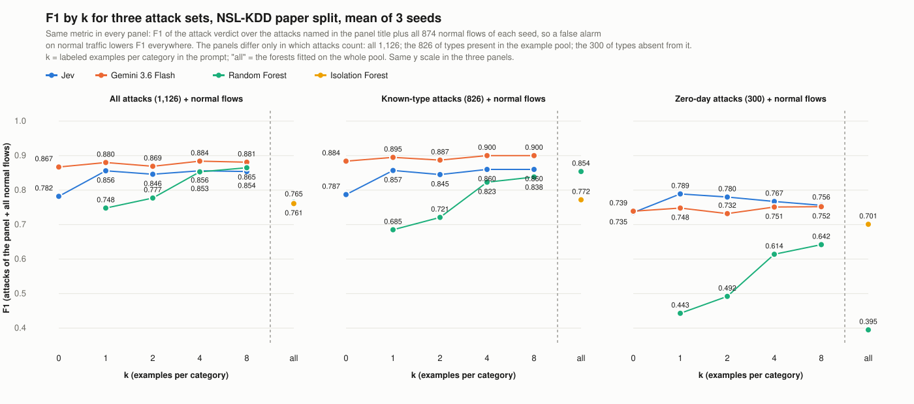
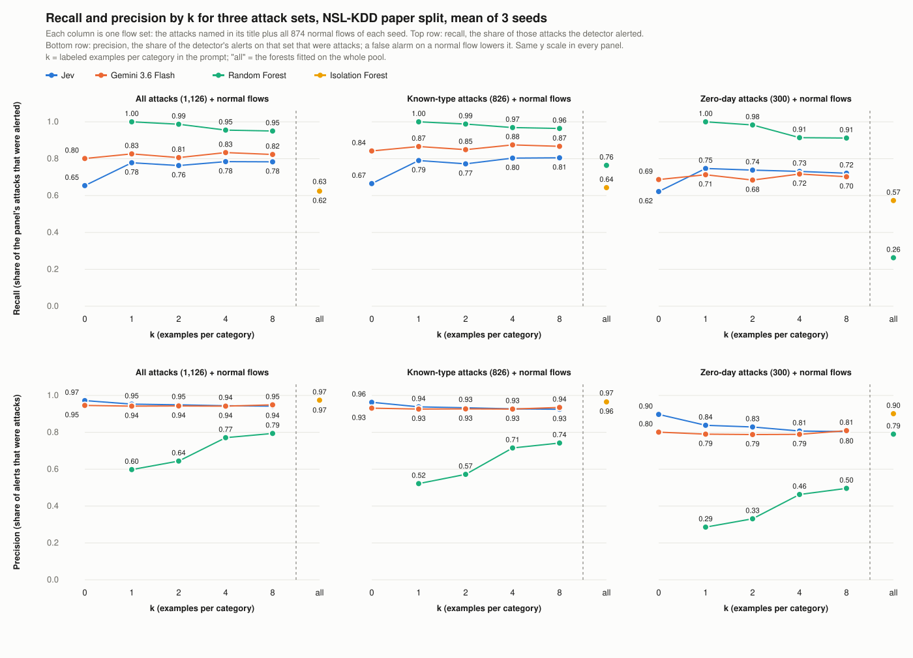
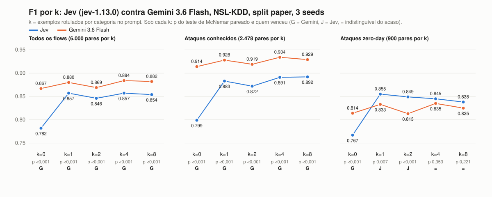

# Results

Paper split of NSL-KDD (2,000 flows, 300 of them zero-day attacks), 3 seeds, k in {0, 1, 2, 4, 8}; runs of 2026-09-22 in `results/paper/`.
Jev is `jev-1.13.0` through the TypeSafe SDK; Gemini is `gemini-3.6-flash` on Vertex AI through Agno. Prices are the list prices in
`prices.json` on that date.

## Terms

- **k**: labeled example flows per category placed in the prompt before the flow to judge. k = 0 is no example; k = 8 is 8 normal, 8 dos,
  8 probe, 8 r2l and 8 u2r flows, each with its label.
- **Zero-day attack**: a flow whose attack type is absent from the example pool (`novel_attack` in the split), so no k can show an example
  of it. **Known attack**: an attack type present in the pool.
- **Discordant pairs**: flows where the two detectors gave different verdicts (one said attack, the other normal) on the same flow, seed
  and k. Only these separate the two; "Jev right" counts how many of them Jev got right, the rest Gemini got right.
- **p**: exact two-sided McNemar test on the discordant pairs, the probability of a split at least this uneven if both detectors were
  equally good. Below 0.05 the difference is not chance; 0.35 could be.

## Reading

Gemini 3.6 Flash is the best detector on F1 over all flows at every k (paired McNemar p < 0.001), and on known-type attacks. Jev is
second, with the same precision (0.94 to 0.97 against 0.94 to 0.95), 6 to 9 times lower latency and 10 to 25 times lower cost. On
zero-day attacks Jev is the best detector from k = 1 to k = 8 among those that keep precision above 0.8; the Random Forest catches
more zero-day attacks only by alerting on 32 to 87% of the normal flows. The Isolation Forest is the conservative reference: precision
0.97, recall 0.62.

## One metric, three attack sets

Every panel below uses the same metric: the attack-class score over a flow set that always holds the 874 normal flows of each seed plus
one group of attacks: all 1,126, the 826 of types present in the example pool ("known"), or the 300 of types absent from it
("zero-day"). A false alarm on normal traffic therefore lowers F1 and precision in every panel; the panels differ only in which attacks
count. An F1 over zero-day attacks alone, without the normal flows, would have no false alarms in it and would rank detectors as recall
does, which is why it is not used here.





| Detector         | k   | F1 all | F1 known | F1 zero-day | Precision all | Precision zero-day | Recall all | Recall known | Recall zero-day |
| ---------------- | --- | ------ | -------- | ----------- | ------------- | ------------------ | ---------- | ------------ | --------------- |
| Jev              | 0   | 0.782  | 0.787    | 0.735       | 0.972         | 0.897              | 0.654      | 0.665        | 0.622           |
| Jev              | 1   | 0.856  | 0.857    | 0.789       | 0.953         | 0.838              | 0.778      | 0.790        | 0.747           |
| Jev              | 2   | 0.846  | 0.845    | 0.780       | 0.949         | 0.829              | 0.763      | 0.772        | 0.738           |
| Jev              | 4   | 0.856  | 0.860    | 0.767       | 0.944         | 0.807              | 0.784      | 0.803        | 0.731           |
| Jev              | 8   | 0.854  | 0.860    | 0.756       | 0.942         | 0.804              | 0.783      | 0.805        | 0.721           |
| Gemini 3.6 Flash | 0   | 0.867  | 0.884    | 0.739       | 0.946         | 0.801              | 0.801      | 0.842        | 0.687           |
| Gemini 3.6 Flash | 1   | 0.880  | 0.895    | 0.748       | 0.942         | 0.790              | 0.826      | 0.866        | 0.713           |
| Gemini 3.6 Flash | 2   | 0.869  | 0.887    | 0.732       | 0.943         | 0.788              | 0.806      | 0.849        | 0.684           |
| Gemini 3.6 Flash | 4   | 0.884  | 0.900    | 0.751       | 0.942         | 0.789              | 0.833      | 0.875        | 0.717           |
| Gemini 3.6 Flash | 8   | 0.881  | 0.900    | 0.752       | 0.949         | 0.809              | 0.823      | 0.867        | 0.702           |
| Random Forest    | 1   | 0.748  | 0.685    | 0.443       | 0.598         | 0.286              | 1.000      | 1.000        | 1.000           |
| Random Forest    | 2   | 0.777  | 0.721    | 0.492       | 0.644         | 0.331              | 0.987      | 0.988        | 0.983           |
| Random Forest    | 4   | 0.853  | 0.823    | 0.614       | 0.771         | 0.463              | 0.955      | 0.969        | 0.914           |
| Random Forest    | 8   | 0.865  | 0.838    | 0.642       | 0.794         | 0.496              | 0.950      | 0.964        | 0.912           |
| Random Forest    | all | 0.765  | 0.854    | 0.395       | 0.971         | 0.790              | 0.631      | 0.764        | 0.263           |
| Isolation Forest | all | 0.761  | 0.772    | 0.701       | 0.974         | 0.901              | 0.624      | 0.643        | 0.573           |

## F1 per k, paired



The cuts of this table and figure are the ones `jev-ids compare --subset` produces: "known attacks" and "zero-day" hold attack flows
only, so their F1 follows recall; the paired test on discordant flows is what the table is for.

| Cut           | k   | F1 Jev | F1 Gemini | Discordant | Jev right | Gemini right | p       | Winner |
| ------------- | --- | ------ | --------- | ---------- | --------- | ------------ | ------- | ------ |
| All flows     | 0   | 0.782  | 0.867     | 833        | 213       | 620          | < 0.001 | Gemini |
| All flows     | 1   | 0.857  | 0.880     | 508        | 195       | 313          | < 0.001 | Gemini |
| All flows     | 2   | 0.846  | 0.869     | 515        | 199       | 316          | < 0.001 | Gemini |
| All flows     | 4   | 0.857  | 0.884     | 506        | 178       | 328          | < 0.001 | Gemini |
| All flows     | 8   | 0.854  | 0.882     | 472        | 159       | 313          | < 0.001 | Gemini |
| Known attacks | 0   | 0.799  | 0.914     | 489        | 25        | 464          | < 0.001 | Gemini |
| Known attacks | 1   | 0.883  | 0.928     | 266        | 38        | 228          | < 0.001 | Gemini |
| Known attacks | 2   | 0.872  | 0.919     | 235        | 22        | 213          | < 0.001 | Gemini |
| Known attacks | 4   | 0.891  | 0.934     | 227        | 24        | 203          | < 0.001 | Gemini |
| Known attacks | 8   | 0.892  | 0.929     | 190        | 18        | 172          | < 0.001 | Gemini |
| Zero-day      | 0   | 0.767  | 0.814     | 206        | 74        | 132          | < 0.001 | Gemini |
| Zero-day      | 1   | 0.855  | 0.833     | 118        | 74        | 44           | 0.007   | Jev    |
| Zero-day      | 2   | 0.849  | 0.813     | 162        | 105       | 57           | < 0.001 | Jev    |
| Zero-day      | 4   | 0.845  | 0.835     | 167        | 90        | 77           | 0.353   | tie    |
| Zero-day      | 8   | 0.838  | 0.825     | 171        | 94        | 77           | 0.221   | tie    |

Pairs per k: 6,000 (all), 2,478 (known attacks), 900 (zero-day). Gemini wins on known attacks at every k; on zero-day attacks Jev wins at
k = 1 and 2 and the two are indistinguishable at k = 4 and 8.

## Recall on zero-day attacks, by category

| Detector | k   | Zero-day | Known | Zero-day dos | Zero-day probe | Zero-day r2l | Zero-day u2r |
| -------- | --- | -------- | ----- | ------------ | -------------- | ------------ | ------------ |
| Jev      | 0   | 0.622    | 0.665 | 0.657        | 0.804          | 0.000        | 0.750        |
| Jev      | 1   | 0.747    | 0.790 | 0.811        | 0.926          | 0.151        | 0.633        |
| Jev      | 2   | 0.738    | 0.772 | 0.789        | 0.904          | 0.198        | 0.667        |
| Jev      | 4   | 0.731    | 0.803 | 0.729        | 0.913          | 0.262        | 0.783        |
| Jev      | 8   | 0.721    | 0.805 | 0.729        | 0.897          | 0.222        | 0.800        |
| Gemini   | 0   | 0.687    | 0.842 | 0.649        | 0.962          | 0.087        | 0.767        |
| Gemini   | 1   | 0.713    | 0.866 | 0.734        | 0.958          | 0.071        | 0.650        |
| Gemini   | 2   | 0.684    | 0.849 | 0.684        | 0.958          | 0.000        | 0.700        |
| Gemini   | 4   | 0.717    | 0.875 | 0.709        | 0.994          | 0.008        | 0.817        |
| Gemini   | 8   | 0.702    | 0.867 | 0.689        | 0.981          | 0.008        | 0.800        |

The gap lives in zero-day r2l, where Jev reaches 0.26 recall with examples and Gemini stays near zero. The Random Forest reports 0.91 to
1.00 zero-day recall at the price of 0.60 to 0.79 precision: it calls almost everything an attack.

## Cost and latency

| k   | Cost Jev (USD / 1M flows) | Cost Gemini | Ratio | Latency Jev | Latency Gemini | Ratio |
| --- | ------------------------- | ----------- | ----- | ----------- | -------------- | ----- |
| 0   | 43                        | 1,068       | 25×   | 310 ms      | 2.24 s         | 7.2×  |
| 1   | 74                        | 1,651       | 22×   | 315 ms      | 2.42 s         | 7.7×  |
| 2   | 106                       | 2,409       | 23×   | 308 ms      | 2.65 s         | 8.6×  |
| 4   | 169                       | 2,869       | 17×   | 322 ms      | 2.13 s         | 6.6×  |
| 8   | 295                       | 3,035       | 10×   | 335 ms      | 1.99 s         | 5.9×  |

Cost is list price for one million flows: the tokens of a call times the per-million-token prices, Gemini's thinking tokens billed as
output. The ratio narrows at k = 8 because Vertex served 4,004 of the 6,269 input tokens from cache at a tenth of the price; Jev has no
cache. Gemini's price is the promotional one through 2026-12-31 and doubles on 2027-01-01. Gemini's latency was measured with five
processes in parallel on a congested day (transient 429, 500, 504 and connection resets, all repaired with `redo-errors`), so it is a
real-day figure, not a floor.

## Reproducing

```bash
make paper-summary
uv run jev-ids compare --a results/paper/*-jev-paper/ --b results/paper/*-llm-gemini-paper/ --subset all
uv run jev-ids compare --a results/paper/*-jev-paper/ --b results/paper/*-llm-gemini-paper/ --subset known
uv run jev-ids compare --a results/paper/*-jev-paper/ --b results/paper/*-llm-gemini-paper/ --subset novel
```

The three `compare` outputs are saved as `results/paper/compare-jev-gemini-{all,known,novel}.csv`; `--subset novel` is the zero-day cut.
Every run directory holds `config.json` (spec, hashes of card, split and prompt, code commit, `redone` passes) and `predictions.jsonl`
(one row per flow, k, seed and repetition). `responses.jsonl`, the raw model answers, stays out of git.
