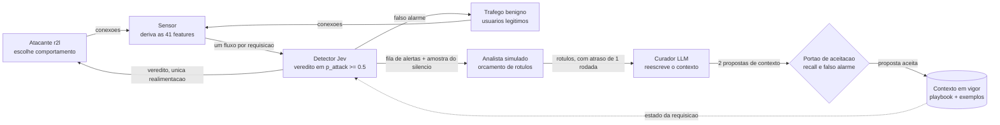
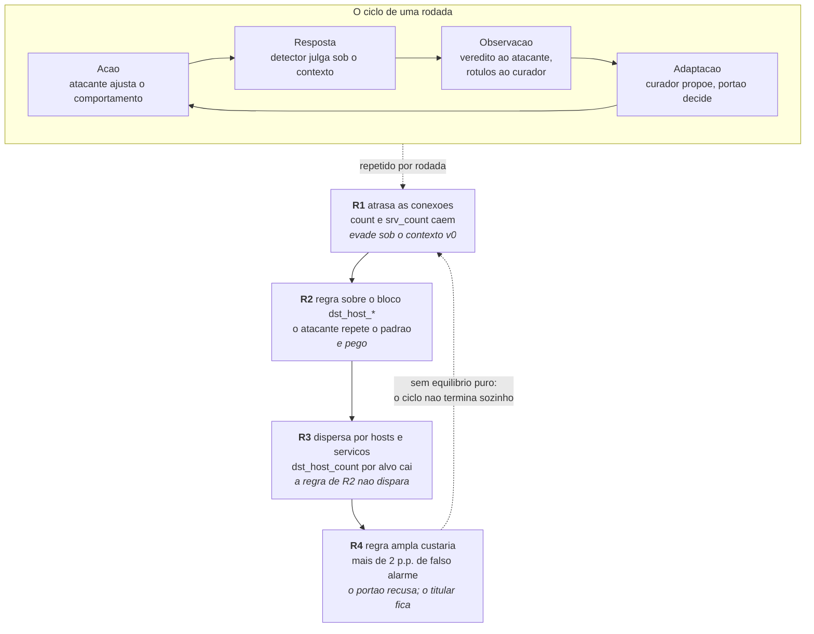
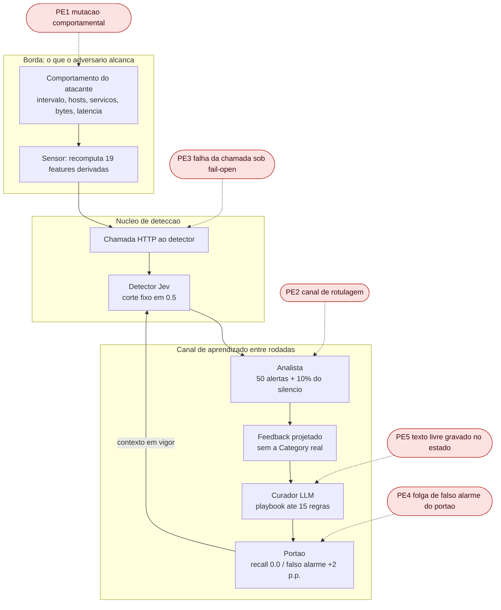

# Um laço adversarial sobre o Jev IDS

### Trabalho 1 — Análise de um sistema adversarial · Engenharia de Software adversarial

**A interação analisada, em uma frase:** *uma tentativa de login remoto chega ao sensor, vira um fluxo
de 41 atributos e recebe um veredito do detector; o atacante ajusta seu comportamento a partir desse
veredito, e o defensor reescreve o contexto do detector a partir dos rótulos que um analista teve
tempo de produzir.*

Este relatório descreve um sistema **existente e em construção neste mesmo repositório**. O sistema
base é o **Jev IDS**, um detector de intrusão que julga um fluxo de rede por requisição com o Jev, um
*System One Model* da TypeSafe. Este trabalho o bifurca e acrescenta um laço adversarial: um atacante
evasivo, um curador que reescreve o contexto do detector entre rodadas, um analista simulado com
orçamento de rótulos e um portão de aceitação que recusa contextos caros demais.

Nenhum resultado experimental é relatado aqui. O laço ainda não foi executado. Este é, como a
especificação do trabalho pede, um documento de **planejamento, modelagem estratégica e análise de
ameaças**; toda a aritmética que aparece é de parâmetros já fixados em arquivo ou de medições já feitas
sobre o conjunto de dados, nunca de execuções do laço.

**Como ler.** Os números de configuração vêm de [`configs/arena.toml`](../configs/arena.toml); os
tamanhos e a composição dos conjuntos, de
[`data/nsl-kdd/splits/SOURCE.json`](../data/nsl-kdd/splits/SOURCE.json); o protocolo, de
[`docs/arena/loop-design.md`](../docs/arena/loop-design.md); os fatos sobre as features e a
literatura, de [`docs/arena/evasion-constraints.md`](../docs/arena/evasion-constraints.md)
e [`docs/arena/empirical-constraints.md`](../docs/arena/empirical-constraints.md); os
resultados publicados do sistema base, do [`README.md`](../README.md) do repositório. As referências
completas estão em [`fontes/referencias.md`](fontes/referencias.md).

Blocos marcados assim —

> **[A COMPLETAR — exemplo]** pergunta que o grupo precisa responder.

— são decisões de julgamento que **o grupo precisa tomar e defender oralmente**. Não são lacunas de
redação: são os pontos em que o valor do trabalho depende de uma posição do grupo, não de um fato
disponível.

---

## Sumário

1. [Descrição do sistema adversarial](#1-descrição-do-sistema-adversarial)
2. [Modelo estratégico estático](#2-modelo-estratégico-estático)
3. [Modelo estratégico dinâmico](#3-modelo-estratégico-dinâmico)
4. [Ameaças e riscos](#4-ameaças-e-riscos)
5. [Relação com o trabalho base e o que este projeto acrescenta](#5-relação-com-o-trabalho-base-e-o-que-este-projeto-acrescenta)
6. [Limitações](#6-limitações)
7. [Declaração de uso de IA generativa](#7-declaração-de-uso-de-ia-generativa)
8. [Contribuições individuais](#8-contribuições-individuais)

---

## 1. Descrição do sistema adversarial

### 1.1 O sistema e o recorte

O **Jev IDS** classifica registros de fluxo de rede do conjunto NSL-KDD. Para cada fluxo ele monta uma
requisição ao Jev contendo instruções, os nomes das colunas, as descrições das cinco Categorias
(`normal`, `dos`, `probe`, `r2l`, `u2r`) e um punhado de fluxos rotulados como exemplos, e faz duas
perguntas tipadas: `is_attack`, que volta como probabilidade, e `category`, que volta como uma das
cinco opções com uma confiança. O **veredito** é `attack` quando `p_attack >= 0.5` — o mesmo corte para
todos os detectores comparados, sem ajuste por detector. Nos resultados publicados sobre o *split*
`paper` (2.000 fluxos, 1.126 deles ataques), com k = 1 exemplo por Categoria, o Jev alcança F1 0,856,
precisão 0,953, recall 0,778, **43 falsos alarmes sobre 874 fluxos benignos**, 0,32 s e US$ 74 por
milhão de fluxos.

**O recorte deste trabalho não é "detecção de intrusão".** É uma interação única e delimitada:

> **Uma tentativa de login remoto contra um servidor da rede é observada pelo sensor, convertida em um
> fluxo de 41 atributos, submetida ao detector em uma requisição e recebe um veredito.**

Concretamente, são ataques da Categoria **r2l** — *remote-to-local*, adivinhação de credenciais
(`guess_passwd`) e abuso de FTP anônimo (`warezmaster`) — o que a configuração fixa em
`attacker.categories = ["r2l"]`. Fica **fora do recorte**: a resposta do SOC ao alerta, o bloqueio, o
caminho de pacotes, a exfiltração posterior, e as outras Categorias de ataque, que aparecem apenas como
tráfego de fundo que o portão também precisa não estragar.

O que torna esta interação repetível — e portanto um jogo, e não um evento — é o laço que este projeto
acrescenta em volta dela. Entre uma rodada e a seguinte, o **Contexto** do detector pode ser reescrito:
um *playbook* de até 15 regras curtas colocado no estado da requisição, e a escolha de até 10 fluxos
rotulados do Pool para servirem de exemplos. Tudo o mais na requisição — as instruções, as colunas, as
descrições das Categorias, o texto das duas perguntas e o corte em 0,5 — é protocolo e **nenhum
Contexto pode tocar**.

### 1.2 Atores

O trabalho pede pelo menos dois participantes capazes de decidir. Este sistema tem quatro, mais um
quinto que não decide nada e paga parte da conta.

| Ator | Objetivo | Ações ou capacidades | Informações observáveis | Restrições ou custos |
|---|---|---|---|---|
| **Atacante r2l** (evasivo) | Fazer com que uma tentativa de login remoto **não gere alerta**, sem deixar de ser um ataque r2l | **Escolher uma faixa de doadores** — perfis de tráfego real com o comportamento desejado: ritmo mais lento, dispersão por hosts, dispersão por serviços — e copiar delas o bloco inteiro das 19 features derivadas; mover `duration` e `src_bytes` dentro dos limites medidos. **Não escreve nem calcula valores de feature derivada** (§1.6) | Apenas o **veredito** que o detector devolve, por fluxo (`attacker.observes = "verdict"`). Não vê o Contexto, o *playbook*, os exemplos, o portão nem o `p_attack` | Até **30 chamadas ao detector por fluxo**, 20 fluxos por rodada. Não pode alterar as 12 features de conteúdo nem as intrínsecas sem destruir o próprio ataque. Só alcança os perfis que o sensor já produziu. Cada sondagem é uma conexão que o sensor registra |
| **Detector** (Jev sob um Contexto) | Dar o veredito correto para cada fluxo | Uma requisição por fluxo, duas perguntas tipadas, veredito em `p_attack >= 0.5` | O fluxo sob julgamento, mais o Contexto em vigor. Não tem memória entre requisições nem sabe que existe um laço | Não decide nada sobre si: seu comportamento só muda porque o Contexto mudou. Chamada remota, sujeita a falha; sob `on_failure = "open"`, falha conta como ausência de alerta |
| **Curador** (agente LLM) | Escrever um Contexto que recupere o recall perdido sem custar falsos alarmes | Propor **2 Contextos por rodada**: reescrever o *playbook* (≤ 15 regras) e trocar os exemplos (≤ 10 fluxos do Pool) | Só o `Feedback` do analista, projetado por `for_curator`: `row_id`, veredito do detector, `p_attack` e o **rótulo que o analista escreveu**. **Nunca** a Category real, nunca `arena-val`, nunca `paper`, nunca se um rótulo foi adulterado | Atraso de **1 rodada** nos rótulos. Teto de 200 chamadas ao seu próprio modelo por execução. Suas propostas só entram em vigor se o portão aceitar |
| **Analista** (humano simulado) | Rotular o que der tempo | Revisar a fila de alertas até **50 por rodada**, do maior `p_attack` para baixo, mais **10% dos fluxos que não geraram alerta** | O tráfego da rodada e os vereditos do detector | O orçamento acima. Erra uma fração `label_noise` dos rótulos (0,0 no padrão). É o **único** canal por onde uma detecção perdida vira conhecimento |
| **Portão de aceitação** | Impedir que o Contexto piore o sistema | Aceitar ou recusar cada proposta. Recusa quem perde recall ou custa falsos alarmes demais | Os vereditos de cada proposta e do titular sobre o **mesmo** conjunto retido | Recall não pode cair (`recall_slack = 0.0`, e uma queda só conta contra a proposta quando o teste exato de McNemar a coloca abaixo de p = 0,05); falso alarme pode subir no máximo **2 pontos percentuais**; precisa de ao menos 30 fluxos de ataque para decidir |
| **Usuário legítimo** *(não decide)* | Fazer login e ser deixado em paz | Nenhuma no modelo | Nenhuma | Paga os falsos alarmes: o login barrado, a conta travada, a hora de analista gasta à toa |

O **usuário legítimo** está na tabela de propósito. Ele não é jogador — não escolhe, não observa, não
adapta — mas é quem sofre o custo de toda defesa agressiva. Confundi-lo com um ator decisório seria um
erro de modelagem; omiti-lo seria pior, porque é dele o custo que o portão existe para limitar.

### 1.3 O ativo a preservar

O ativo primário é **o veredito correto sobre uma tentativa de login remoto**, em suas duas faces, que
não podem ser separadas:

- **Detecção** — a tentativa de ataque gera alerta (recall sobre r2l);
- **Sobriedade** — o login legítimo não gera alerta (o orçamento de falsos alarmes, hoje 43 em 874
  fluxos benignos, cerca de 4,9%).

Comprar uma às custas da outra não preserva o ativo: é trocá-lo por outro. Um Contexto que alerta sobre
tudo tem recall 1,0 e destrói o sistema. É exatamente por isso que o portão mede as duas coisas e o
critério de recall não é "subir", é "não cair enquanto o custo de falso alarme fica onde estava".

Um ativo secundário, mas que sustenta o primeiro: **a capacidade de medir**. O corte fixo em 0,5, o
`prompt_hash` que viaja em cada linha de predição, o *split* `paper` jamais usado para aprender e a
comparação pareada existem para que "o curador ajudou" seja uma afirmação verificável e não uma
impressão. Um sistema que perde a capacidade de medir perde a capacidade de saber se está perdendo.

> **[A COMPLETAR — Ativo]** O grupo precisa **escolher uma das duas faces como primária** e defender a
> escolha na apresentação, porque a tabela de risco da seção 4 herda essa decisão: se o ativo primário
> é a detecção, a evasão (A1) domina; se é a sobriedade, o abuso da folga do portão (PE4) sobe de
> posição e o impacto de A1 cai. Argumentem a partir de quem é o usuário do sistema no cenário que
> vocês escolherem defender — um SOC com fila saturada e um serviço exposto à internet têm respostas
> opostas.

### 1.4 Quem observa o quê: a assimetria de informação

Nenhum lado enxerga o outro por inteiro, e o desenho do sistema faz disso uma escolha explícita:

- O **atacante** recebe um bit por fluxo: alertou ou não alertou. A configuração
  `attacker.observes` admite também `"p_attack"`, que entregaria a probabilidade inteira — um
  adversário estritamente mais forte, porque uma probabilidade é um gradiente e um veredito é apenas
  um sinal. O padrão é o adversário mais fraco, por honestidade experimental.
- O **curador** nunca vê a verdade. Vê o que o analista escreveu, projetado por `for_curator`, e a
  projeção esconde deliberadamente tanto a Category real quanto a marca de adulteração. Se soubesse
  quais rótulos foram envenenados, o experimento de envenenamento (A2) mediria um curador que não
  existe.
- O **portão** vê os dois lados sobre o mesmo conjunto retido, e é o único que vê isso.
- O **detector** não vê nada além do fluxo e do Contexto. Não tem memória. Toda a adaptação da defesa
  acontece fora dele.

### 1.5 Custos e restrições

Os limites não são retóricos; estão em arquivo e o laço se recusa a iniciar uma execução que não cabe
neles.

| Restrição | Valor | Onde |
|---|---|---|
| Sondagens do atacante | 20 fluxos × 30 chamadas = 600 por rodada | `attacker.flows_per_round`, `max_queries_per_flow` |
| Pontuação do portão | 250 fluxos × 2 propostas = 500 chamadas por rodada | `gate_split`, `curator.proposals_per_round` |
| Total por rodada | 1.100 chamadas; 11.000 em 10 rodadas | contra um teto de **20.000** |
| Chamadas ao modelo do curador | 200 por execução | `budget.max_curator_calls` |
| Orçamento de rótulos | 50 alertas + 10% do silêncio, por rodada | `analyst.alert_budget`, `sample_rate` |
| Atraso dos rótulos | 1 rodada | `analyst.delay_rounds` |
| Folga de falso alarme | +2 pontos percentuais | `gate.false_alarm_slack` |

O orçamento de chamadas é a razão pela qual o padrão usa **uma** semente: três sementes custariam
33.000 chamadas e não cabem sob o teto. Isso não é detalhe operacional — é uma restrição que limita
diretamente a força estatística de qualquer conclusão do Trabalho 2.

### 1.6 Como o atacante age: mimetismo restrito por substituição de doador

Esta subseção existe porque a resposta mais óbvia está errada, e mostrar *por que* está errada é um dos
resultados do trabalho.

**O primeiro plano, e por que ele morreu.** A ideia inicial era modelar a computação do sensor: o
atacante escolheria parâmetros de comportamento — intervalo entre conexões, dispersão por hosts,
dispersão por serviços — e as 19 features derivadas seriam **calculadas** a partir deles. É o que a
intuição pede, e é o que boa parte da área faz. As medições sobre os **125.973 fluxos do Pool**
mataram o plano, por duas razões independentes:

1. **As identidades de acoplamento que tal modelo teria de respeitar são violadas pelos próprios
   dados**, e não por arredondamento:

   | Identidade prevista pela literatura | Violação no Pool |
   |---|-:|
   | `dst_host_srv_count ≤ dst_host_count` | **27,5%** |
   | `same_srv_rate + diff_srv_rate = 1` | **37,5%** |
   | `dst_host_same_srv_rate + dst_host_diff_srv_rate = 1` | **60,5%** |

   A causa: cada par é calculado sobre **duas janelas paralelas** — uma sobre as conexões ao mesmo
   *host*, outra sobre as conexões ao mesmo *serviço* — e não sobre uma janela única particionada,
   como se costuma ler; e as contagens `dst_host_*` saturam em 255. Uma única identidade numérica de
   taxa sobreviveu ao teste: `same_srv_rate ≈ min(1, srv_count/count)`.

2. **O NSL-KDD não tem timestamps nem ordenação de conexões.** O log de conexões não pode ser
   reexecutado, de modo que **nenhum modelo causal dessas features pode ser validado neste conjunto de
   dados** — nem o nosso, nem o de ninguém.

Somadas, as duas razões dizem a mesma coisa: sintetizar valores derivados seria inventar números cuja
consistência conjunta ninguém consegue conferir. Um fluxo assim pode ser impossível de o sensor emitir,
e um "sucesso de evasão" sobre um fluxo impossível não é um resultado — é um artefato.

**O que o atacante faz em vez disso.** *Mimetismo restrito por substituição de doador*:

- **copia o bloco inteiro** das 19 features derivadas de **um fluxo real que o sensor efetivamente
  produziu** — o doador;
- **mantém as features fixas do ataque**, as que definem a semântica de um `guess_passwd` ou de um
  `warezmaster`, porque removê-las removeria o ataque;
- **move apenas `duration` e `src_bytes`**, as duas alavancas diretas, dentro dos limites medidos.

O argumento é simples e é o ponto forte do desenho: **quaisquer que sejam os acoplamentos verdadeiros,
um bloco real os satisfaz por construção.** O atacante não precisa conhecer a regra de derivação; ele
toma emprestado um conjunto de valores que já passou por ela. É exatamente a projeção no espaço-problema
de Pierazzi et al. (2020), com as *side-effect features* chegando **em bloco** em vez de uma a uma.

**O que o atacante devolve é uma Estratégia, não um fluxo.** Uma Estratégia é *a faixa de doadores
escolhida mais os valores das alavancas diretas*. Essa é a propriedade de que todo o resto depende: um
fluxo mutado é um caso isolado; uma Estratégia **transfere para fluxos que o atacante nunca tocou**, e é
sobre isso que o teste de generalização do portão se apoia.

**E a narrativa comportamental continua valendo.** Reduzir o ritmo e dispersar por hosts e serviços
seguem sendo as jogadas do atacante — é assim que os doadores são agrupados em faixas. O que mudou é
**como** ele as realiza: em vez de *calcular* um perfil de tráfego lento, ele **seleciona um perfil de
tráfego real já observado** que tem aquela característica. A jogada é a mesma; a sua realização deixou
de ser síntese e passou a ser escolha.

> **Uma observação que vale a pena fazer na apresentação.** A partição de features do IDSGAN, muito
> citada na área, libera para r2l exatamente as 19 features derivadas — as que o atacante menos consegue
> definir. Este trabalho não se limita a discordar por argumento: mostra, com número e sobre 125.973
> fluxos, que o modelo que tal liberdade exigiria **não se sustenta nos dados**. É uma refutação
> empírica de uma suposição corrente, e não uma preferência de desenho.

### 1.7 Pressupostos e como falham

**P1 — O atacante não consegue escrever valores de feature.**
Este é o pressuposto científico central do trabalho. Das 41 features do NSL-KDD, **19 são recomputadas
pelo sensor a partir do log de conexões do próprio atacante**: as de janela temporal de 2 segundos
(`count`, `srv_count`, as taxas de erro e de serviço) e as dez do bloco `dst_host_*`, calculadas sobre
uma janela de 100 conexões ao mesmo host. A descrição oficial da tarefa do KDD Cup 1999 define essas
janelas, e Apruzzese et al. (2022) afirmam que um ataque em espaço de features "não é um modelo de
ameaça realista", porque quem calcula as features é o defensor, no momento da inferência.

*Como falha:* um adversário que alcance o sensor ou o pipeline de extração **pode** escrevê-las — mas
isso exige privilégio administrativo sobre o componente de ML, e é um ataque diferente, com outra
superfície. O que este projeto **não** faz é a falha oposta, a de muitos trabalhos da área: escrever os
valores derivados por conta própria. Como a §1.6 mostra, ele copia um bloco real em vez de calcular um,
justamente porque calcular exigiria um modelo que os dados rejeitam.

**P2 — O rótulo do analista é a verdade.**
O curador nunca vê a Category real. Tudo o que ele aprende passa por um humano simulado com orçamento.

*Como falha:* por três caminhos independentes. **Escassez** — a fila de alertas é mais funda que os 50
rótulos do orçamento, e apenas 10% dos fluxos silenciosos são olhados, de modo que um ataque perdido só
vira conhecimento se cair naquela amostra (dos 20 fluxos de ataque mutados de uma rodada, cerca de
**dois**). **Ruído** — `label_noise` modela o analista cansado. **Adulteração** — a ameaça A2, em que
uma fração dos rótulos de ataque é reescrita como benigna; o curador não tem como perceber, porque a
projeção `for_curator` esconde exatamente essa informação.

**P3 — Uma chamada ao detector que falha é um evento raro e independente do ataque.**
O sistema base é explícito: *fail open* — uma chamada que falha vira uma linha com `error` e conta como
ausência de alerta, nunca como uma queda do processo.

*Como falha:* congestionamento do provedor já foi observado na execução publicada (respostas 429, 500 e
504 transitórias, reparadas depois com `redo-errors`). O pressuposto perigoso não é a falha em si, é a
**independência**: um adversário que consiga produzir volume transforma a falha em algo correlacionado
com o ataque, e cada falha durante a janela é um fluxo que passa sem alerta. O sistema traz
`on_failure = "closed"` como alternativa, e o custo dela é trocar omissões por falsos alarmes.

**P4 — O conjunto retido mede generalização.**
O portão pontua cada proposta sobre `arena-val` (250 fluxos: 150 benignos, 100 de ataque), disjunto de
`arena`, e o curador nunca o vê.

*Como falha:* se a Estratégia de uma rodada — a faixa de doadores e as alavancas diretas — não for
representativa da técnica, o teste
mede memorização de um caso particular; e 100 fluxos de ataque podem ser poucos para o teste de McNemar
detectar uma queda real de recall. O próprio portão admite esse limite ao exigir
`min_attack_flows = 30` antes de se pronunciar.

> **[A COMPLETAR — Pressupostos]** Acrescentem **um quinto pressuposto de leitura própria do grupo**,
> com o mesmo tratamento: enunciado, por que o sistema depende dele, e ao menos um caminho concreto de
> falha. Candidatos que o material sustenta e este relatório não desenvolveu: *"o Pool é representativo
> do tráfego que o detector verá"* (§6 mostra que não é — a assinatura de `guess_passwd` cai de 98%
> no Pool para 38% no KDDTest+), ou *"o curador escreve regras em bom português e o detector as lê
> como o curador pretendeu"*. Isso vale nota no critério de *Delimitação e fundamentos adversariais*.

### 1.8 Diagrama de contexto

Fonte editável: [`diagramas/contexto.mmd`](diagramas/contexto.mmd).



Duas leituras importam neste diagrama. A primeira: a única seta que volta ao atacante carrega **um
bit**. A segunda: o caminho do detector até o Contexto é longo, passa por um humano com orçamento,
atrasa uma rodada e termina num portão que pode recusar. A defesa é estruturalmente mais lenta que o
ataque, e isso não é um defeito de implementação — é a forma do problema.

### 1.9 Por que isto é adversarial, e não apenas um erro

Um detector com recall 0,778 erra 22% dos ataques sem que ninguém o ataque. Essas omissões são **erro**:
ruído estatístico. O que este sistema modela é outra coisa, e as três diferenças são verificáveis:

1. **A omissão é escolhida, não sorteada.** O atacante gasta até 30 chamadas por fluxo procurando
   especificamente a Estratégia que vira o veredito. Uma omissão por ruído não é procurada; esta é o
   resultado de uma busca cuja função objetivo é a saída do detector.
2. **O que ele encontra é uma Estratégia, não um fluxo.** Este é o motivo pelo qual o atacante devolve
   uma faixa de doadores mais as alavancas diretas, e não um vetor de features (§1.6). Um fluxo mutado é
   um caso; uma Estratégia é uma
   **técnica**, e uma técnica transfere para fluxos que o atacante nunca tocou. É exatamente sobre isso
   que o teste de generalização do portão se apoia: a proposta é julgada sobre fluxos de `arena-val`
   mutados com a Estratégia da rodada, não sobre os fluxos que o curador viu.
3. **A resposta do defensor muda o payoff do atacante — e vice-versa.** Um erro estatístico não
   responde a uma correção. Aqui, a regra escrita na rodada *n* torna a estratégia da rodada *n−1*
   inútil, o que obriga o atacante a gastar orçamento numa estratégia nova, o que produz tráfego novo
   que o analista pode rotular, o que muda o que o curador pode escrever. É uma interação estratégica
   fechada, e a seção 2 mostra que ela **não tem ponto de repouso**.

> **[A COMPLETAR — Por que é adversarial]** Tragam **um exemplo concreto de omissão do sistema base que
> não é adversarial** e contrastem com a evasão. O material oferece um candidato forte, em
> `docs/arena/empirical-constraints.md` §3.1: o detector aprende do Pool que
> `num_failed_logins > 0` é o sinal de `guess_passwd` (98,1% dos 53 fluxos do Pool), mas essa feature
> aparece em apenas 37,9% dos 1.231 fluxos de `guess_passwd` do KDDTest+. As omissões daí decorrentes
> são um **descasamento de distribuição entre treino e teste**, não um adversário — e argumentar essa
> distinção é precisamente o que a especificação cobra ao advertir contra "tratar todo erro como ação
> adversarial".

---

## 2. Modelo estratégico estático

### 2.1 Jogadores, ações e o que elas significam

Uma rodada, congelada. Dois jogadores, duas ações cada.

**Atacante** (linhas):

- **A1 — Repetir o padrão.** Reusar a Estratégia que funcionou na rodada anterior — a mesma faixa de
  doadores, as mesmas alavancas diretas. Custo
  próximo de zero: nenhuma busca, poucas conexões, exposição mínima.
- **A2 — Mudar o padrão.** Procurar uma Estratégia nova. Custo real: até 600 chamadas ao detector na rodada,
  cada uma uma conexão registrada pelo sensor, e uma degradação do próprio ataque (espalhar tentativas
  de senha por mais hosts significa menos tentativas por alvo).

**Curador** (colunas):

- **C1 — Manter o contexto.** Não propor nada. Custo zero: nenhum rótulo consumido para essa
  finalidade, nenhuma chamada de curador, nenhum falso alarme novo, *playbook* não cresce.
- **C2 — Atualizar o contexto.** Propor dois Contextos a partir do `Feedback` disponível — que, pelo
  atraso de uma rodada, descreve o comportamento do atacante **na rodada anterior**. Custo real: 500
  chamadas de pontuação do portão, chamadas ao modelo do curador, espaço no *playbook* (teto de 15
  regras) e até 2 pontos percentuais a mais de falso alarme sobre tráfego legítimo.

### 2.2 A matriz

Ordem do par: **(payoff do atacante, payoff do curador)**. Escala ordinal 0–3, em que 3 é o melhor
resultado para aquele jogador e 0 o pior. Os números representam **ordem de preferência**, não
utilidade cardinal.

| Atacante \ Curador | **C1 — Manter o contexto** | **C2 — Atualizar o contexto** |
|---|-:|-:|
| **A1 — Repetir o padrão** | `(3, 0)` | `(0, 3)` |
| **A2 — Mudar o padrão** | `(2, 2)` | `(1, 1)` |

### 2.3 Por que cada resultado recebeu esses payoffs

**(A1, C1) = (3, 0) — o atacante repete, a defesa não se mexe.**
O melhor mundo possível para o atacante: a Estratégia que evadiu na rodada passada evade de novo, sem gastar
nenhuma das 30 chamadas por fluxo, e cada sondagem economizada é uma conexão a menos no log que poderia
ser amostrada. Payoff 3. Para o curador é o pior mundo: um ataque passa, e passa por um detector que
**tinha informação suficiente para pegá-lo** — o `Feedback` da rodada anterior descreve exatamente esse
padrão. É uma omissão evitável. Payoff 0.

**(A1, C2) = (0, 3) — o atacante repete, a defesa atualiza.**
Espelho do anterior. O curador escreveu a regra a partir dos rótulos que descrevem o padrão da rodada
passada, e o atacante entregou exatamente esse padrão. É pego. Para o atacante, payoff 0: além de
detectado, a Estratégia está **queimada** — o *playbook* é persistente e a mesma técnica não voltará a
funcionar. Para o curador, payoff 3: pagou o custo da adaptação e comprou detecção com ele; e como a
regra passou pelo teste de generalização do portão sobre `arena-val`, ela cobre a técnica e não apenas
os fluxos vistos.

**(A2, C1) = (2, 2) — o atacante muda, a defesa fica parada.**
O atacante evade — mas gastou a busca à toa: contra um detector que não mudou, o padrão velho também
teria funcionado. Evasão real, orçamento desperdiçado, e centenas de conexões de sondagem a mais no
log. Payoff 2, abaixo do 3 de (A1, C1). Para o curador, payoff 2: perdeu esta rodada, mas **não pagou
nada** — nenhum rótulo consumido numa atualização condenada, nenhum falso alarme novo sobre tráfego
legítimo, *playbook* enxuto. E a busca do atacante gerou tráfego a mais, que aumenta a chance de algo
cair na amostra do analista. A omissão é barata e informativa.

**(A2, C2) = (1, 1) — os dois se mexem.**
O curador escreveu uma regra contra o comportamento da rodada anterior; o atacante já não o usa. O
curador pagou tudo — pontuação do portão, chamadas do modelo, uma regra a mais no *playbook*, até 2
pontos percentuais de falso alarme — e comprou pouca ou nenhuma detecção nesta rodada. Payoff 1, abaixo
do 2 de (A2, C1). O atacante pagou a busca **e** enfrenta um alvo móvel: a regra nova pode, por ter
sido validada sobre fluxos mutados com a Estratégia daquela rodada, já cobrir parte do espaço para onde
ele se moveu. Payoff 1, abaixo do 2 de (A2, C1).

> **[A COMPLETAR — Payoffs]** Uma única desigualdade sustenta toda a seção: **para o curador,
> (A2, C1) = 2 > (A2, C2) = 1** — ou seja, contra um atacante que está mudando, ficar parado é melhor do
> que atualizar. O argumento aqui é que o atraso de uma rodada (`analyst.delay_rounds = 1`) faz a
> atualização mirar uma técnica já abandonada, e que uma regra comprada por até 2 pontos percentuais de
> falso alarme contra um alvo morto é pior que regra nenhuma. **O grupo precisa defender ou rejeitar
> isso.** Se rejeitarem — se acharem que o teste de generalização do portão faz a regra cobrir também
> a técnica seguinte —, então "Atualizar" passa a ser **estratégia estritamente dominante** para o
> curador, existe equilíbrio puro em (A2, C2), e **as seções 2.5 a 2.7 precisam ser reescritas**. Esta é
> a decisão mais consequente do relatório inteiro.

### 2.4 Melhores respostas

**Atacante:**

- contra **C1 (Manter)**: A1 dá 3, A2 dá 2 → melhor resposta **A1, repetir**.
- contra **C2 (Atualizar)**: A1 dá 0, A2 dá 1 → melhor resposta **A2, mudar**.

**Curador:**

- contra **A1 (Repetir)**: C1 dá 0, C2 dá 3 → melhor resposta **C2, atualizar**.
- contra **A2 (Mudar)**: C1 dá 2, C2 dá 1 → melhor resposta **C1, manter**.

### 2.5 Existe estratégia dominante?

**Não, para nenhum dos dois.** Uma estratégia dominante é melhor independentemente do que o outro faz,
e aqui cada jogador troca de melhor resposta conforme a ação do oponente:

- o atacante prefere A1 contra C1 e A2 contra C2;
- o curador prefere C2 contra A1 e C1 contra A2.

É exatamente a situação que a especificação do trabalho descreve como o ponto central a demonstrar: **a
melhor decisão de cada um depende da escolha do outro.**

### 2.6 Não existe equilíbrio em estratégias puras — e o ciclo é a corrida armamentista

Testando as quatro células, uma a uma, pela definição (alguém melhora desviando sozinho?):

| Célula | Desvio lucrativo | Equilíbrio? |
|---|---|:-:|
| (A1, C1) = (3, 0) | o curador vai a C2 e sai de 0 para 3 | ✗ |
| (A1, C2) = (0, 3) | o atacante vai a A2 e sai de 0 para 1 | ✗ |
| (A2, C2) = (1, 1) | o curador vai a C1 e sai de 1 para 2 | ✗ |
| (A2, C1) = (2, 2) | o atacante vai a A1 e sai de 2 para 3 | ✗ |

**Nenhuma célula é equilíbrio de Nash em estratégias puras.** As melhores respostas formam um ciclo
fechado:

```
(Repetir, Manter) → o curador atualiza → (Repetir, Atualizar)
                  → o atacante muda    → (Mudar,   Atualizar)
                  → o curador mantém   → (Mudar,   Manter)
                  → o atacante repete  → (Repetir, Manter)   [fecha]
```

Este ciclo **é** a corrida armamentista. Não é um defeito do modelo nem uma escolha infeliz de payoffs:
é o conteúdo do modelo. Um sistema adversarial cujo jogo de um estágio não tem equilíbrio puro é um
sistema que **não converge sozinho**. O que interrompe o ciclo não é o jogo — é um orçamento que acaba
(`rounds = 10`, `max_detector_calls = 20000`) ou uma assimetria estrutural, e a seção 3 mostra que este
sistema tem uma assimetria estrutural de verdade: o bloco `dst_host_*`, que o atacante não consegue
mover reduzindo o ritmo.

### 2.7 Equilíbrio em estratégias mistas

Como não há equilíbrio puro, procura-se o equilíbrio em estratégias mistas. Sejam:

- **p** = probabilidade de o atacante jogar **A1 (repetir)**; 1 − p de jogar A2;
- **q** = probabilidade de o curador jogar **C1 (manter)**; 1 − q de jogar C2.

**Passo 1 — p sai da indiferença do curador.** Em equilíbrio misto, o curador só randomiza se as duas
ações lhe renderem o mesmo:

```
E[C1] = p·0 + (1−p)·2 = 2 − 2p
E[C2] = p·3 + (1−p)·1 = 1 + 2p

2 − 2p = 1 + 2p   →   1 = 4p   →   p = 1/4
```

**Passo 2 — q sai da indiferença do atacante:**

```
E[A1] = q·3 + (1−q)·0 = 3q
E[A2] = q·2 + (1−q)·1 = 1 + q

3q = 1 + q   →   2q = 1   →   q = 1/2
```

**Equilíbrio:** o atacante **repete o padrão em 1/4 das rodadas e muda em 3/4**; o curador **mantém o
contexto em metade das rodadas e atualiza na outra metade**.

**Payoffs de equilíbrio:** E[atacante] = 3 × 1/2 = **1,5**; E[curador] = 2 − 2 × 1/4 = **1,5**.
(Confere pela outra ação de cada um: E[A2] = 1 + 1/2 = 1,5; E[C2] = 1 + 2 × 1/4 = 1,5.)

### 2.8 Esse resultado é bom para o sistema e para os usuários legítimos?

**Para os dois jogadores, é medíocre e nenhum consegue melhor.** Ambos ficam em 1,5 numa escala de 0 a
3. O atacante não chega perto do 3 que obteria contra um defensor estático; o curador não chega perto do
3 de flagrar uma repetição. É o preço de enfrentar alguém que também pensa.

**Para o sistema, é melhor do que as alternativas de canto** — e é aí que está o resultado útil. Um
curador que nunca atualiza (q = 1) leva o atacante a repetir sempre, e a célula (A1, C1) dá ao curador o
payoff 0: evasão permanente e gratuita. Um curador que sempre atualiza (q = 0) é previsível, e o
atacante responde mudando sempre, o que leva a (A2, C2) = (1, 1): o defensor paga o custo integral todas
as rodadas e o atacante evade. **A mistura é uma prescrição concreta: a cadência de atualização precisa
ser imprevisível.** Um curador cujo calendário o atacante consegue antecipar perde a única vantagem que
a randomização oferece.

**Para os usuários legítimos, não é gratuito, e isso precisa ser dito.** No equilíbrio, o curador
atualiza em metade das rodadas — e por p = 1/4, em **três de cada quatro** dessas rodadas o atacante já
terá mudado, de modo que a atualização não compra detecção alguma. Essas atualizações não são neutras:
cada Contexto aceito pode custar até 2 pontos percentuais de falso alarme. Sobre os 874 fluxos benignos
do *split* `paper`, 2 pontos percentuais são cerca de **17 alertas falsos a mais**, somados aos 43 já
existentes — e cada um deles é um login legítimo suspeitado e uma hora de analista gasta à toa. **O
equilíbrio embute um custo recorrente que recai integralmente sobre quem não é parte do conflito.**

> **[A COMPLETAR — Equilíbrio misto]** Duas perguntas que o grupo precisa responder e que dependem de um
> julgamento, não de um dado: **(a)** vocês aceitam que "cadência de atualização imprevisível" seja um
> controle de segurança recomendável, sabendo que ela torna o comportamento do sistema mais difícil de
> auditar e de explicar a um cliente? **(b)** quantos falsos alarmes a mais por rodada vocês consideram
> aceitáveis para manter a imprevisibilidade — ou seja, `gate.false_alarm_slack = 0.02` é generoso
> demais, apertado demais, ou está certo? Justifiquem pelo cenário de uso, não pelo valor do arquivo.

---

## 3. Modelo estratégico dinâmico

A matriz da seção 2 é uma fotografia. Aqui ela vira filme. As rodadas abaixo estão ancoradas no
mecanismo real de derivação das features do NSL-KDD, e não em uma narrativa plausível: cada efeito
citado tem origem na descrição oficial da tarefa do KDD Cup 1999, em Lee & Stolfo (2000) ou nas medições
registradas em `docs/arena/empirical-constraints.md`.

### 3.1 Quatro rodadas

| Rodada | Ação do participante | Resposta do sistema ou defensor | O que se torna observável? | Adaptação para a rodada seguinte |
|-:|---|---|---|---|
| **1** | O atacante joga **ritmo mais lento**: seleciona doadores na faixa dos perfis de tráfego real de baixa cadência e copia deles o bloco inteiro das 19 features derivadas; sobre `duration` e `src_bytes` usa as alavancas diretas, viáveis em r2l — no Pool, `duration` vai a p90 = 134 s e p99 = 12.546 s. O bloco chega **pronto e mutuamente consistente**: nesses doadores `count` e `srv_count` já são baixos, por serem contagens brutas numa janela **fixa de 2 s**, e `same_srv_rate` já acompanha — `same_srv_rate ≈ min(1, srv_count/count)` vale dentro de 0,005 em 98,9% do Pool. O atacante não calculou nada disso; herdou | Contexto **v0**, sem *playbook*, k = 1 exemplo por Categoria. O bloco temporal do fluxo passa a parecer o de uma conexão tranquila; `p_attack` cai abaixo de 0,5. **Sem alerta** | **Para o atacante:** um bit por fluxo — "não alertou" —, e a busca lhe diz *qual faixa de doadores* virou o veredito. **Para o defensor:** quase nada. Esses fluxos não geraram alerta, então só chegam ao analista pela amostra de 10% do silêncio: dos 20 fluxos de ataque da rodada, cerca de **2** são olhados e rotulados r2l | O curador da rodada 2 lê esses 2 rótulos (com 1 rodada de atraso) e enfrenta o fato estrutural que decide o jogo: nos doadores lentos, as dez features `dst_host_*` **não acompanham** a queda, porque sua janela é de 100 conexões ao mesmo host e não um intervalo de tempo. Escreve uma regra apontando o detector para lá |
| **2** | O atacante **repete** a Estratégia da rodada 1 — mesma faixa de doadores, mesmas alavancas. É a jogada A1, a mais barata | O curador propõe **2 Contextos**; o portão julga cada proposta e o titular sobre o **mesmo** conjunto: os 150 fluxos benignos de `arena-val` inalterados mais seus fluxos de ataque mutados com a Estratégia **desta** rodada. Aceita se o recall não cair e o falso alarme subir no máximo 2 p.p. — sobre 150 fluxos benignos, **no máximo 3 alertas falsos a mais**. Aceito, entra em vigor: o detector **alerta** | **Para o atacante:** o veredito virou. Ele sabe que a defesa se moveu, mas **não sabe o quê** — nunca vê o Contexto. **Para o defensor:** os fluxos entram na fila de alertas (orçamento de 50), o analista confirma r2l e o rótulo é de boa qualidade, porque veio do topo da fila ordenada por `p_attack` | O atacante não tem para onde ir dentro da faixa lenta: é precisamente contra ela que o bloco host-based foi construído. A descrição da tarefa do KDD é explícita — as features host-based existem porque "alguns ataques de varredura escaneiam os hosts usando um intervalo muito maior que dois segundos". Ele precisa trocar de faixa: **dispersão** |
| **3** | O atacante joga **dispersão por hosts e serviços**: passa a selecionar doadores entre os perfis reais de tráfego espalhado, em que `dst_host_count` e `dst_host_srv_count` por alvo são baixos e `srv_diff_host_rate` e `dst_host_srv_diff_host_rate` são altos. De novo são valores reais, não calculados. A regra da rodada 2, que se apoiava em `dst_host_count` alto, deixa de disparar | Resultado **misto**: parte dos fluxos volta a evadir, parte ainda alerta. O portão não é acionado contra o titular; o Contexto em vigor continua o mesmo | **Para o atacante:** vereditos divididos — informação mais rica que na rodada 1, porque o contraste entre os fluxos que passaram e os que não passaram localiza a fronteira da regra. **Para o defensor:** fila mista. O analista gasta o orçamento nos 50 maiores `p_attack` e amostra 10% do silêncio. Aparece a **nova** assinatura: poucas conexões por alvo, muitos alvos | O curador precisa escrever uma regra sobre a **assinatura acoplada** e não sobre uma feature isolada, porque para cada feature isolada existe uma faixa de doadores reais que a desfaz. O teste de generalização do portão é o que separa as duas coisas: uma regra que decorou os 20 fluxos de `arena` não se sustenta sobre os fluxos de `arena-val` mutados com a mesma Estratégia |
| **4** | O atacante **mantém a dispersão** e a leva mais longe, estreitando a faixa de doadores até tomá-los de perfis que são, eles próprios, de varredura administrativa legítima | O curador propõe a regra ampla — "logins que tocam muitos hosts com poucas conexões em cada". Ela **também** descreve a varredura matinal de um administrador, um agente de monitoramento e uma rotina de backup. O falso alarme sobre os benignos de `arena-val` ultrapassa a folga de 2 p.p. e **o portão recusa**. O titular permanece; a rodada registra o motivo | **Para o atacante:** continua evadindo, e agora com uma informação valiosa que ele obtém **de graça**: existe uma região do espaço de comportamento em que a defesa não consegue entrar sem quebrar o tráfego legítimo. **Para o defensor:** a recusa é o registro explícito de um conflito entre detecção e sobriedade | O atacante aprende a se **esconder dentro da restrição do defensor**, não do detector. O curador precisa de outra coisa que não uma regra mais ampla: exemplos melhores (até 10 do Pool), uma regra condicionada ao serviço, ou aceitar o risco residual. É aqui que a defesa encontra seu limite real |

Duas propriedades que a especificação do trabalho pede explicitamente e que estas rodadas exibem:

- **A resposta do sistema também produz informação.** Na rodada 2, o veredito que virou informa ao
  atacante que a defesa se moveu; na rodada 4, a recusa do portão informa que existe um refúgio. Toda
  defesa vaza.
- **Uma defesa produz custo para usuários legítimos.** A rodada 4 é o caso puro: a regra que pegaria o
  atacante é recusada **porque** atingiria demais quem não é atacante. O portão protege os usuários
  legítimos e, com o mesmo gesto, deixa o atacante no lugar.

### 3.2 Diagrama do ciclo adaptativo

Fonte editável: [`diagramas/ciclo-adaptativo.mmd`](diagramas/ciclo-adaptativo.mmd).



### 3.3 As cinco perguntas

**Quem observa quem?**
Ninguém observa tudo. O atacante observa **um bit por fluxo**, o veredito — e nada do Contexto, do
*playbook*, dos exemplos, do portão ou do analista. Se `attacker.observes` for mudado para `"p_attack"`,
ele passa a ver a probabilidade inteira, que é um gradiente: adversário estritamente mais forte, e a
diferença entre as duas execuções mede exatamente quanto vale esse vazamento. O curador observa apenas
a projeção `for_curator` do que o analista escreveu — nunca a Category real, nunca `arena-val`, nunca
`paper`, nunca se um rótulo foi adulterado. O analista observa o tráfego da rodada até onde o orçamento
alcança. O portão observa os dois lados sobre o mesmo conjunto retido, e é o único que observa isso.

**O que cada lado consegue mudar?**
O atacante muda **de qual tráfego real ele se disfarça**: escolhe a faixa de doadores — ritmo mais
lento, dispersão por hosts, dispersão por serviços — e move `duration` e `src_bytes` dentro dos limites
medidos. Não escreve **nem calcula** valores de feature derivada: as 19 chegam em bloco, copiadas de um
fluxo que o sensor produziu (§1.6), e as de conteúdo são o próprio ataque (zerar `num_failed_logins`
para evadir um
detector de `guess_passwd` remove o ataque). O curador muda **duas coisas e só duas**: o *playbook*
(≤ 15 regras) e os exemplos (≤ 10 fluxos do Pool). Não toca as instruções, as colunas, as descrições das
Categorias, o texto das perguntas nem o corte em 0,5. Essa fronteira é o que torna o experimento
interpretável: se o curador pudesse mexer no corte, "o curador melhorou o recall" e "o curador baixou o
limiar" seriam indistinguíveis.

**O que dispara uma adaptação?**
No atacante: um veredito `attack` sobre uma Estratégia que antes evadia. É um gatilho imediato e barato de
observar. No curador: a chegada do `Feedback` de uma rodada — com **uma rodada de atraso** — mostrando
ataques perdidos na amostra do silêncio ou ataques confirmados no topo da fila. É um gatilho lento,
indireto e limitado pelo orçamento de rótulos. **Os gatilhos são assimétricos em velocidade**, e essa
assimetria é permanente.

**Qual é o custo da adaptação para cada lado?**
Para o atacante: até 600 chamadas ao detector por rodada, cada uma uma conexão que o sensor registra e
que pode cair na amostra do analista; e a degradação do próprio ataque, já que dispersar tentativas de
senha por mais hosts significa menos tentativas por alvo. Para o defensor: 500 chamadas de pontuação do
portão por rodada, chamadas ao modelo do curador contra um teto de 200 por execução, o consumo do
orçamento de rótulos e — o custo que importa — até 2 pontos percentuais de falso alarme, que caem sobre
o tráfego legítimo e não sobre o defensor.

**Em que ponto surge uma corrida armamentista?**
No ciclo de melhores respostas da seção 2.6, que não fecha em nenhuma célula. Concretamente: a rodada 2
torna inútil a estratégia da rodada 1, a rodada 3 torna inútil a regra da rodada 2, e a rodada 4 mostra
que a regra que resolveria a rodada 3 é recusada pelo portão. Cada defesa cria o problema seguinte. O
que impede a corrida de ser infinita neste sistema não é o jogo — é **orçamento** (10 rodadas, 20.000
chamadas) e uma **assimetria estrutural**: as dez features `dst_host_*`, cuja janela de 100 conexões foi
construída em 2000 por Lee & Stolfo exatamente para que reduzir o ritmo não bastasse. O defensor tem uma
vantagem que não precisou inventar; ela é finita, e a rodada 3 mostra onde ela acaba.

> **[A COMPLETAR — Fim da corrida]** Neste experimento a corrida termina porque o orçamento acaba: 10
> rodadas e 20.000 chamadas. **Num sistema real não há essa parada.** O grupo precisa responder o que
> encerra a corrida numa implantação de verdade, e a resposta muda o desenho do Trabalho 2. Três
> hipóteses defensáveis, e vocês precisam escolher e argumentar: **(a)** *economia* — a corrida termina
> quando o ataque fica mais caro que o ganho, e nesse caso o objetivo da defesa não é detectar, é
> **encarecer**; **(b)** *assimetria estrutural* — termina quando a defesa encontra um sinal que o
> atacante não consegue mover sem deixar de atacar, como o bloco `dst_host_*` é para quem reduz o ritmo,
> e nesse caso o objetivo é **procurar esses sinais**; **(c)** *não termina* — a defesa só consegue
> encarecer indefinidamente, e o objetivo é **sobreviver ao ciclo** mantendo o custo para o usuário
> legítimo constante. Justifiquem pela seção 2.6: um jogo sem equilíbrio puro **não converge sozinho**,
> então a hipótese escolhida precisa dizer o que vem de fora do jogo para pará-lo.

---

## 4. Ameaças e riscos

### 4.1 Pontos de exploração

Cinco superfícies. As três primeiras dão origem aos cenários A1, A2 e A3; as duas últimas são
registradas porque aparecem nas rodadas modeladas e o Trabalho 2 vai encontrá-las.

| ID | Ponto de exploração | Onde vive | Por que é explorável |
|---|---|---|---|
| **PE1** | **Superfície de mutação comportamental** | Entre o comportamento do atacante e o sensor | 19 das 41 features são recomputadas a partir do log de conexões do atacante. Ele não as escreve nem as calcula, mas **escolhe de qual tráfego real herdá-las** (§1.6), e o faz com custo baixo e sem privilégio nenhum sobre o sistema |
| **PE2** | **Canal de rotulagem** | `analyst.review` → `Feedback` → `for_curator` → curador | É a **única** fonte de aprendizado do curador, e por construção ele não pode auditá-la: a projeção esconde a Category real e a marca de adulteração |
| **PE3** | **Chamada ao detector sob *fail-open*** | A requisição HTTP à API do detector | Uma chamada que falha vira uma linha com `error` e conta como **ausência de alerta**. Sob volume, a falha deixa de ser rara e independente |
| **PE4** | **Folga de falso alarme do portão** | `gate.false_alarm_slack = 0.02` | É um orçamento, e orçamentos se gastam. Um atacante que se aproxime do perfil do tráfego benigno torna caras justamente as regras que o pegariam, e o portão as recusa **em nome dos usuários legítimos** |
| **PE5** | **Texto livre gravado no estado do detector** | O *playbook* que o curador escreve em `state.playbook` | O curador é um LLM que escreve texto a partir de dados que o adversário influenciou, e esse texto vai para o estado de outro modelo. É uma superfície de injeção via conteúdo |

Fonte editável: [`diagramas/superficie-de-ataque.mmd`](diagramas/superficie-de-ataque.mmd).



### 4.2 Cenários de ameaça

> **A1 — Evasão.** Um **atacante remoto r2l** pode **fazer uma tentativa de adivinhação de credenciais
> deixar de gerar alerta** por meio da **superfície de mutação comportamental (PE1): a escolha de
> doadores de tráfego real com ritmo mais lento ou maior dispersão por hosts e serviços, mais as
> alavancas diretas `duration` e `src_bytes`**, aproveitando
> **o pressuposto de que a assinatura do ataque nas 19 features derivadas é independente do perfil de
> tráfego em que ele é executado**, causando **perda de recall sobre r2l e a passagem silenciosa da
> tentativa de login** sobre **o ativo "veredito correto", em sua face de detecção**.

> **A2 — Envenenamento do canal de rotulagem.** Um **adversário com influência sobre o canal de
> rotulagem** pode **fazer com que fluxos de ataque sejam registrados como benignos** por meio do
> **canal analista → `Feedback` → curador (PE2), na proporção `threats.poisoned_fraction = 0.1`**,
> aproveitando **o pressuposto de que o rótulo do analista é a verdade, já que o curador nunca vê a
> Category real nem sabe quais rótulos foram adulterados**, causando **a escrita de regras que ensinam o
> detector a ignorar justamente o padrão do ataque, com efeito persistente de rodada em rodada** sobre
> **a integridade do Contexto e, por consequência, sobre o recall**.

**A2 não é uma invenção deste grupo: é técnica catalogada.** O MITRE ATLAS a registra como
**AML.T0080 — AI Agent Context Poisoning**, com as subtécnicas **.000 Memory** e **.001 Thread**; e
**AML.T0020 — Training Data Poisoning**, da tática *Persistence*, descreve explicitamente alterar
rótulos ou anotações e manipular processos de feedback e coleta de dados — que é literalmente o que a
função `poison()` do analista faz. No OWASP Top 10 for LLM Applications 2025, a categoria correspondente
é **LLM04:2025 Data and Model Poisoning**.

> **A3 — Falha sob volume, com *fail-open*.** Um **atacante capaz de gerar volume ou de provocar
> congestionamento no provedor** pode **fazer chamadas ao detector falharem (timeout, 429, 5xx)** por
> meio da **interface síncrona com a API do detector sob `threats.on_failure = "open"` (PE3)**,
> aproveitando **o pressuposto de que uma chamada falha é um evento raro e estatisticamente independente
> do ataque**, causando **a passagem sem alerta de todo fluxo julgado durante a janela de falha,
> independentemente de quão evidente seja o ataque** sobre **a disponibilidade da detecção**.

### 4.3 Avaliação de risco

Escala: probabilidade e impacto de 1 (baixo) a 3 (alto); risco = probabilidade × impacto.

| ID | Cenário de ameaça | Ponto de exploração | Pressuposto ou fraqueza | Ativo afetado | Probabilidade | Impacto | Risco |
|---|---|---|---|---|-:|-:|-:|
| **A1** | Evasão de r2l por mutação de comportamento | PE1 — superfície de mutação comportamental | **P1**: a assinatura do ataque não depende do perfil de tráfego em que ele corre | Veredito correto (detecção) | **3** | **3** | **9** |
| **A2** | Envenenamento dos rótulos que o curador lê | PE2 — canal de rotulagem | **P2**: o rótulo do analista é a verdade | Integridade do Contexto → recall | **2** | **3** | **6** |
| **A3** | Omissão em massa sob falha, com *fail-open* | PE3 — chamada ao detector | **P3**: falha é rara e independente do ataque | Disponibilidade da detecção | **2** | **2** | **4** |

**Como cada número foi atribuído:**

- **A1, probabilidade 3.** É o fenômeno que o laço existe para produzir, e a literatura diz que
  funciona: Apruzzese et al. (2023) registram que a evasão observada na prática usa "estratégias
  relativamente simples, ainda que frequentemente eficazes". Não requer privilégio, insider nem
  conhecimento do modelo — só paciência e um alvo.
- **A1, impacto 3.** O ativo primário é perdido por inteiro naquele fluxo. E, de novo, o essencial: o
  que o atacante encontra é uma **estratégia transferível**, não um fluxo mutado. Um sucesso não é uma
  omissão; é uma técnica que passa a valer para fluxos que ele nunca tocou.
- **A2, probabilidade 2.** Exige alcance sobre o canal de rotulagem — um insider, ou um adversário que
  consiga moldar o que o analista vê ao ponto de induzir o rótulo errado. É menos provável que A1
  porque exige mais.
- **A2, impacto 3.** Corrompe a **única** fonte de aprendizado do defensor, e o defensor não tem como
  perceber: `for_curator` esconde tanto a verdade quanto a marca de adulteração. Uma regra envenenada
  fica no *playbook* e atravessa rodadas.
- **A3, probabilidade 2.** Não é hipotética: a execução publicada do sistema base já encontrou 429, 500
  e 504 transitórios num dia congestionado, reparados depois com `redo-errors`. Fazer isso acontecer de
  propósito é mais difícil que aproveitá-lo quando acontece.
- **A3, impacto 2.** Grave, mas **contido e visível**. A janela é curta, as linhas de erro ficam
  registradas e contáveis — a checagem de integridade do portão recusa um Contexto cuja taxa de erro
  passe de 5% —, e a política oposta, `on_failure = "closed"`, está a uma mudança de configuração de
  distância, ao custo de trocar omissões por falsos alarmes.

> **[A COMPLETAR — Probabilidade e impacto]** Estes seis números são **julgamentos**, não medições, e o
> grupo precisa confirmá-los ou mudá-los e saber defender cada um oralmente. Dois merecem discussão
> específica: **(a)** a probabilidade de **A2** depende inteiramente de quem vocês modelam como capaz de
> alcançar o canal de rotulagem — se o modelo de ameaça incluir um insider no SOC, ela vira 3 e A2
> empata com A1; **(b)** o impacto de **A1** cai para 2 se vocês decidirem, na seção 1.3, que o ativo
> primário é a sobriedade e não a detecção. **Os números da tabela e a escolha de ativo têm de ser
> consistentes entre si.**

### 4.4 A ameaça prioritária: A1, evasão por mutação de comportamento

Risco 9, o mais alto, e o fenômeno que o projeto inteiro existe para medir.

**1. Como o sistema poderia responder.**
Não com uma regra sobre uma feature isolada — para cada feature isolada existe uma faixa de doadores
reais que a desfaz. A
resposta correta se apoia na **assimetria estrutural** que o defensor já tem: as dez features
`dst_host_*` são calculadas sobre uma janela de 100 conexões ao mesmo host, e não sobre um intervalo de
tempo, precisamente para derrotar quem reduz o ritmo. O curador escreve uma regra sobre a **assinatura
acoplada** — poucas conexões na janela de 2 s combinadas com uma janela host-based que não acompanhou a
queda, sobre um serviço de login — e troca os exemplos por fluxos r2l lentos. O portão então valida a
proposta sobre `arena-val` mutado com a Estratégia daquela rodada, o que é o teste que separa uma regra
que aprendeu a técnica de uma regra que decorou 20 fluxos.

**2. Que informação essa resposta revelaria.**
O veredito, que vira. O atacante, que só observa esse bit, aprende de imediato *que* a defesa se moveu;
por busca sobre as faixas de doadores de que dispõe, aprende em seguida *qual dimensão do comportamento*
a defesa
passou a vigiar — sem nunca ler uma linha do *playbook*. Sob `attacker.observes = "p_attack"` ele
aprenderia muito mais: a probabilidade dá a direção e a magnitude, não apenas o lado da fronteira.

**3. Como o adversário se adaptaria na rodada seguinte.**
Em três movimentos de custo crescente. Primeiro, **trocar de faixa de doadores**: se o ritmo lento não
basta, os perfis de tráfego espalhado trazem `dst_host_count` e `dst_host_srv_count` por alvo já
baixos — é a rodada 3.
Segundo, **combinar características na escolha do doador**, para que nenhuma feature isolada carregue a
assinatura. Terceiro, e o
mais interessante: **esconder-se dentro da restrição do defensor**. Se ele se aproximar o bastante do
perfil do tráfego benigno, a regra que o pegaria passa a custar mais de 2 pontos percentuais de falso
alarme e **o portão a recusa**. Nesse ponto o atacante não está mais evadindo o detector: está usando o
compromisso do defensor com os usuários legítimos como abrigo.

**4. Que efeitos colaterais atingiriam usuários legítimos.**
Qualquer regra da forma "poucas conexões espalhadas por muitos hosts num serviço de login" também
descreve a varredura matinal de um administrador, um agente de monitoramento e uma rotina de backup. O
ponto de partida são 43 falsos alarmes em 874 fluxos benignos, cerca de 4,9%; a folga do portão permite
subir 2 pontos percentuais por Contexto aceito, o que sobre esses 874 fluxos são cerca de **17 alertas
falsos a mais** — cada um uma tentativa legítima sob suspeita e uma hora de analista consumida. E há um
efeito colateral de segunda ordem, mais insidioso: cada falso alarme ocupa uma vaga no orçamento de 50
alertas por rodada, **empurrando para fora da fila o ataque verdadeiro que estava logo abaixo**. Uma
defesa barulhenta consome o próprio recurso de que depende para aprender.

**5. Que risco continuaria existindo depois da resposta.**
Três riscos residuais, em ordem de gravidade:

- **O atacante ainda tem faixas de doadores nas quais o defensor não pode entrar** sem quebrar o tráfego
  legítimo — e elas existem justamente porque são feitas de tráfego legítimo. A folga de 2 pontos
  percentuais é uma fronteira, e uma fronteira conhecida é um refúgio.
- **A informação vaza a cada defesa.** Toda regra aceita produz uma mudança de veredito, e toda mudança
  de veredito ensina. O defensor não consegue se adaptar em silêncio.
- **O filtro de alcançabilidade dos doadores não é testável neste conjunto de dados.** A substituição de
  doador garante que o bloco copiado é *consistente*, mas não que é *alcançável*: decidir que um atacante
  pode chegar a um perfil mais lento e mais espalhado, e não a um mais rápido e mais concentrado, repousa
  na semântica de derivação publicada, e o NSL-KDD — sem timestamps e sem ordenação de conexões — não
  permite validá-la. É o elo mais fraco do modelo, e a §6 o registra como tal.

**6. O que o sistema precisa continuar preservando apesar das adaptações.**
Quatro invariantes, e nenhuma delas é negociável em troca de recall:

- **O corte em 0,5**, igual para todos os detectores. Se o curador pudesse movê-lo, "o curador melhorou
  o recall" e "o curador baixou o limiar" deixariam de ser distinguíveis.
- **A fronteira do que o Contexto pode mudar**: o *playbook* e os exemplos, e nada mais. Instruções,
  colunas, descrições das Categorias e o texto das perguntas são protocolo.
- **O orçamento de falsos alarmes.** É o que impede a defesa de "vencer" destruindo o sistema. O portão
  recusando uma proposta boa contra o atacante é o mecanismo funcionando, não falhando.
- **A capacidade de medir**: `arena-val` nunca visto pelo curador, `paper` nunca usado para aprender, o
  `prompt_hash` em cada linha de predição, a comparação pareada e as linhas de base (Contexto v0
  congelado e o curador heurístico sem LLM). Sem elas, "o laço funcionou" é uma opinião.

> **[A COMPLETAR — Risco residual]** Dos três riscos residuais acima, **qual o grupo aceita conviver
> com** e **qual exigiria mudar o desenho** antes do Trabalho 2? A pergunta é obrigatória porque a
> especificação adverte contra "apresentar uma defesa como solução definitiva e ignorar a reação
> seguinte". Uma resposta defensável precisa dizer o que ficaria **fora** do escopo do Trabalho 2 e por
> quê.

> **[A COMPLETAR — PE5, injeção pelo *playbook*]** O curador é um LLM que escreve texto livre a partir
> de dados que o adversário influenciou, e esse texto é gravado no estado de outro modelo. O grupo
> precisa decidir se trata PE5 como **ameaça no escopo** — o que exigiria um quarto cenário e uma linha
> na tabela de risco — ou como **fora de escopo declarado**, com a justificativa registrada. Não deixem
> implícito: a rastreabilidade entre arquitetura, superfície e ameaça vale 25 pontos, e um ponto de
> exploração desenhado no diagrama e ausente da tabela de risco é exatamente a inconsistência que o
> critério procura.

---

## 5. Relação com o trabalho base e o que este projeto acrescenta

**O sistema base.** O Jev IDS é trabalho do orientador e de seu grupo. Ele estabelece o detector, o
protocolo de medição e os resultados de referência: um fluxo por requisição, duas perguntas tipadas,
veredito em `p_attack >= 0.5`, comparação contra um LLM, uma Random Forest e uma Isolation Forest sobre
o *split* `paper` de 2.000 fluxos, com três sementes e k de 0 a 8. Ele também estabelece a disciplina
de medição que este trabalho herda inteira: o `prompt_hash` em cada linha, o corte igual para todos os
detectores, a comparação pareada com teste de McNemar, e o *split* `paper` intocado.

**O que este projeto acrescenta.** Cinco coisas, nenhuma delas presente no sistema base:

1. **O laço adversarial.** O sistema base mede um detector **estático** contra um conjunto de dados
   estático. Este projeto o coloca dentro de uma interação repetida, em que a defesa se adapta e o
   ataque responde.
2. **Um atacante que copia tráfego real em vez de sintetizar features.** É a contribuição científica do
   trabalho, e vem em duas partes. A **negativa**: a partição de features do IDSGAN — muito citada —
   libera, para r2l, exatamente as 19 features de janela temporal e host-based, que são as que um
   atacante **menos** consegue definir diretamente, porque é o sensor que as recomputa a partir do log
   de conexões; e este projeto mostra, sobre 125.973 fluxos, que o modelo causal que tal liberdade
   exigiria **não se sustenta nos dados** — as identidades de acoplamento necessárias são violadas em
   27% a 60% do Pool, e o conjunto não tem timestamps que permitam validar modelo causal nenhum (§1.6).
   A **positiva**: o mimetismo restrito por substituição de doador, que copia o bloco derivado inteiro
   de um fluxo real e portanto satisfaz por construção quaisquer acoplamentos verdadeiros — a projeção
   no espaço-problema de Pierazzi et al. (2020), com as *side-effect features* chegando em bloco. O
   ganho não é apenas de defensabilidade: o que o atacante encontra é uma **Estratégia transferível**, e
   é sobre isso que o teste de generalização do portão se sustenta.
3. **Um curador como agente de LLM**, que reescreve o Contexto do detector entre rodadas dentro de uma
   fronteira estrita — *playbook* e exemplos, nada mais —, com uma linha de base heurística sem LLM para
   que "o raciocínio comprou alguma coisa" seja uma afirmação testável. A ideia de evoluir um contexto
   por **deltas incrementais**, em vez de reescrevê-lo inteiro a cada volta, e o **colapso de contexto**
   que a reescrita repetida provoca vêm de Zhang et al. (ICLR 2026), cujos três papéis são Generator,
   Reflector e **Curator** — o mesmo nome que este projeto deu ao componente, por convergência
   independente, e a razão pela qual o nosso curador edita regras por `id` sob um teto de 15 em vez de
   reescrever o *playbook*. O que este trabalho acrescenta àquela ideia é o que falta a ela: um
   **adversário que reage** à evolução do contexto, em vez de uma tarefa parada esperando ser melhorada.
4. **Um analista simulado com orçamento de rótulos**, que é ao mesmo tempo o canal de aprendizado do
   defensor e a superfície da ameaça A2.
5. **Um portão de aceitação com teste de generalização**, que recusa Contextos que perdem recall ou
   custam falsos alarmes demais, e o faz sobre um conjunto retido que o curador nunca vê.

**Os controles sem os quais nada disso significa alguma coisa.** Três linhas de base, e a terceira é a
que impede a conclusão mais fácil e mais errada do trabalho:

- **Contexto v0 congelado** — as mesmas rodadas sem curador nenhum. Tudo o mais é medido contra isto.
- **O curador heurístico** — sem LLM, só exemplos. Se o curador com LLM não o superar, o raciocínio não
  comprou nada.
- **O *playbook* placebo** — tantas regras quantas o Contexto curado carrega, do mesmo comprimento,
  dizendo algo **verdadeiro** sobre tráfego de rede e **inútil** para esta decisão. A razão é direta: o
  *playbook* viaja em toda chamada ao detector, de modo que um Contexto curado é também **um prompt mais
  longo**, e prompts mais longos movem a resposta de um modelo por si sós. Sem este braço, *"o playbook
  ajudou"* é indistinguível de *"mais texto ajudou"*. O placebo é gerado uma única vez a partir da forma
  do Contexto curado final, nunca pelo curador.

**E um número que precisa aparecer ao lado do recall, sempre.** Toda tabela de resultado deve trazer a
média de `input_tokens` junto do recall, por versão de Contexto, pelos dois motivos: é o que permite ler
um ganho de recall contra o comprimento do prompt que o produziu, e é o que o *playbook* custa em
dinheiro — ele é cobrado **em cada fluxo**, e o sistema base fatura entrada a cerca de 1.800 tokens por
fluxo, US$ 74 por milhão. Um Contexto que melhora o recall e dobra o prompt não é o mesmo resultado que
um Contexto que melhora o recall de graça, e a tabela precisa deixar isso visível sem que ninguém tenha
de perguntar.

> **[A COMPLETAR — Fronteira de autoria]** O grupo precisa enunciar, em duas ou três frases e com
> nomes, **o que é do orientador e o que é do grupo**. Esta é uma fronteira que só vocês podem traçar, e
> ela é dupla: é integridade acadêmica e é também o que permite ao grupo responder "o que vocês fizeram
> neste trabalho?" sem hesitar. Sejam específicos: o detector, o protocolo de medição e os resultados
> publicados são do trabalho base; o laço, o atacante comportamental, o curador, o analista e o portão
> são deste projeto.

---

## 6. Limitações

Declaradas aqui porque um trabalho que só apresenta seus pontos fortes é mais fácil de derrubar do que
um que já nomeou seus limites.

**Do conjunto de dados.**
O NSL-KDD corrige o problema mais grave do KDD Cup 99 — Tavallaee et al. (2009) mediram que cerca de
**78% dos registros do treino e 75% do teste eram duplicados**, o que "fará os classificadores ficarem
enviesados em favor dos registros frequentes" — mas os próprios autores registram que o conjunto "ainda
sofre de alguns dos problemas discutidos por McHugh e pode não ser um representante perfeito das redes
reais existentes", justificando-o apenas "pela falta de conjuntos de dados públicos". Mais recentemente,
Goldschmidt & Chudá (2025) concluem que o KDD'99 e o NSL-KDD **"não são mais recomendados para
*benchmarking* de IDS"**, observando ao mesmo tempo que "muitos estudos recentes ainda se apoiam neles".

A defesa possível não é dizer que o NSL-KDD é tráfego realista — não é. É dizer que ele é um **banco de
provas para modelagem de restrições**, cujas 41 features têm semântica de derivação publicada e
verificável. A contribuição está no modelo de restrições, não nos números absolutos de detecção.

**Do que a substituição de doador resolve — e do que ela não resolve.**
Copiar o bloco derivado de um fluxo real resolve o problema da **consistência**: o bloco satisfaz por
construção quaisquer acoplamentos verdadeiros, inclusive os três que os dados rejeitaram e aqueles que
ninguém enunciou. Também elimina a objeção mais óbvia contra trabalhos de evasão sobre NSL-KDD, que é a
de produzir vetores que o sensor jamais poderia ter emitido. Essa parte está resolvida, e resolvida por
construção e não por argumento.

**Do filtro de alcançabilidade dos doadores — o elo mais fraco do modelo.**
O que a substituição de doador **não** resolve é a **alcançabilidade**. Alguém precisa decidir quais
doadores um atacante r2l consegue de fato imitar, e a regra adotada é a da semântica de derivação
publicada: um atacante consegue desacelerar e dispersar, não consegue acelerar e concentrar sem deixar
de ser o que é. **Esse filtro não é testável neste conjunto de dados.** O NSL-KDD não tem timestamps nem
ordenação de conexões, o log não pode ser reexecutado, e portanto nenhuma afirmação sobre o que um
atacante *poderia* ter produzido é falseável a partir dele. O modelo marca essas direções como
`support: synthesis`, e este relatório as apresenta como o que são: raciocínio sobre definições
publicadas, não medição. Escrito sem rodeio: **se o filtro de alcançabilidade estiver errado, a taxa de
evasão medida estará errada junto**, e nada dentro deste conjunto de dados avisaria. É o ponto em que um
avaliador deve pressionar, e é melhor que o grupo chegue lá antes dele.

**Da amostra de r2l.**
O Pool tem 995 fluxos r2l distribuídos por oito nomes de ataque, **quatro deles com menos de 10 fluxos**
(`phf` 4, `spy` 2, `multihop` 7, `ftp_write` 8). E o Pool não prevê o teste: a assinatura de
`num_failed_logins` cobre 98,1% dos fluxos de `guess_passwd` no Pool e apenas **37,9% dos 1.231 fluxos
de `guess_passwd` do KDDTest+**. Um detector que aprende esse sinal do Pool generaliza para pouco mais
de um terço das ocorrências no teste.

**Do desenho do experimento.**
O analista é uma simulação, não um humano: `alert_budget`, `sample_rate` e `label_noise` são uma
caricatura útil de um SOC, não um modelo validado de um. O orçamento de chamadas permite **uma semente**
sob os padrões, o que limita a força estatística de qualquer conclusão. E o laço **ainda não foi
executado**: tudo neste relatório é desenho e análise de ameaças, como a especificação do Trabalho 1
pede ao dizer que "não será exigida implementação de código" nesta etapa.

> **[A COMPLETAR — Postura sobre o conjunto de dados]** O grupo precisa **escolher e defender uma
> postura**: (a) o NSL-KDD é um banco de provas de modelagem de restrições, e a contribuição é o modelo
> de restrições, não os números de detecção; ou (b) o conjunto é inadequado e o trabalho deveria
> migrar — o repositório já traz uma carta e um script de preparação para o NF-UQ-NIDS-v2, sem execução
> ainda. Se escolherem (a), precisam responder à objeção de Goldschmidt & Chudá diretamente, e não por
> omissão. A especificação premia honestidade; uma limitação bem defendida vale mais que uma omitida.

---

## 7. Declaração de uso de IA generativa

Declaração exigida pela seção 6 da especificação do trabalho.

**Ferramenta utilizada.** Claude (Anthropic), operado via Claude Code dentro do repositório do projeto.

**Para quais tarefas foi utilizada.**

1. **Levantamento e verificação de literatura.** Recuperação dos artigos citados, extração das
   definições e das afirmações usadas, e registro de cada uma com autoria, veículo, ano e URL em
   `docs/arena/evasion-constraints.md`. Esse documento marca explicitamente quais afirmações são
   de um artigo citado e quais são raciocínio do próprio projeto (`[synthesis]`), e mantém uma lista do
   que **não** foi possível verificar.
2. **Medição empírica sobre o conjunto de dados.** Escrita do script `scripts/fit_mutations.py`, que
   produziu `data/nsl-kdd/mutations.json` e o relatório `docs/arena/empirical-constraints.md`.
   Todos os números das seções 3 e 6 deste relatório vêm dessas medições, reproduzíveis com
   `uv run python -m scripts.fit_mutations` e `uv run pytest tests/test_mutations.py`.
3. **Redação e estruturação deste relatório**, incluindo as tabelas, a derivação do equilíbrio misto da
   seção 2.7 e o código-fonte Mermaid dos três diagramas.
4. **Implementação do laço** no pacote `jev_ids/arena/`, em trabalho paralelo a este relatório.

**Como o grupo verificou o conteúdo produzido.**

> **[A COMPLETAR — Verificação]** Esta é a parte da declaração que **só o grupo pode escrever**, e a
> especificação pede exatamente isso: *"indicando para quais tarefas foi utilizada e como o grupo
> verificou o conteúdo produzido"*. Registrem o que de fato foi feito, item por item, com nomes. O
> mínimo defensável, e que é possível fazer inteiramente com o material deste repositório:
>
> - **Citações:** abrir cada URL de `fontes/referencias.md` e confirmar autoria, veículo e ano; conferir
>   se cada afirmação atribuída a um artigo neste relatório está mesmo no artigo. As entradas marcadas
>   **⚠ verificar** naquele arquivo são as que exigem essa conferência antes da entrega.
> - **Números de configuração:** conferir cada valor citado aqui contra `configs/arena.toml` e
>   `data/nsl-kdd/splits/SOURCE.json`. Todos os números deste relatório vêm de um desses dois arquivos,
>   dos resultados publicados no `README.md` do repositório, ou das medições de
>   `docs/arena/empirical-constraints.md`.
> - **Medições:** reexecutar `uv run python -m scripts.fit_mutations` e `uv run pytest
>   tests/test_mutations.py` e confirmar que os números da seção 6 batem.
> - **Matemática:** refazer à mão a derivação do equilíbrio misto da seção 2.7 — são duas equações
>   lineares — e verificar as quatro células da tabela de melhores respostas da seção 2.6.
> - **Diagramas:** abrir os três arquivos `.mmd` em <https://mermaid.live> e confirmar que renderizam.
>
> Registrem também **quem fez cada verificação**. A especificação avalia o balanço de contribuições
> individuais, e uma declaração de verificação sem responsáveis nomeados não é verificável.

**O que não foi produzido por IA generativa.** Os resultados experimentais do sistema base, publicados
no `README.md` do repositório; e os resultados do laço adversarial, que **não existem** — o laço ainda
não foi executado, e nenhum número de execução aparece neste relatório.

---

## 8. Contribuições individuais

> **[A COMPLETAR — Contribuições]** A especificação exige que "cada integrante possua contribuições
> identificáveis no histórico do repositório" e adverte que **a nota não é única para o grupo**, podendo
> haver discrepância entre os membros mais atuantes e os demais. Preencham a tabela abaixo com nomes,
> usuários do GitHub e as seções de que cada um foi responsável, e garantam que o histórico de *commits*
> corresponde ao que está escrito aqui. Lembrem também da segunda exigência da mesma seção: **equilíbrio
> na fala durante a apresentação**.

| Integrante | Usuário no GitHub | Seções sob responsabilidade | Verificações realizadas |
|---|---|---|---|
| | | | |
| | | | |
| | | | |
| | | | |

---

## A pergunta final da especificação

> **Depois que o sistema responder, o que o outro lado aprenderá e tentará fazer em seguida?**

Aprenderá **que** a defesa se moveu — pelo veredito que virou, único bit que ele recebe — e, por busca
sobre as faixas de doadores de que dispõe, **qual dimensão do comportamento** passou a ser vigiada, sem
jamais ler o *playbook*. Tentará, em seguida, trocar de faixa: se o tráfego lento deixou de bastar, os
perfis espalhados por hosts e serviços; se a dispersão deixar de bastar, doadores que combinem as duas
características.

E então tentará a coisa mais interessante e a que este relatório considera o resultado central da
análise: **parar de evadir o detector e passar a se esconder dentro da restrição do defensor**.
Escolhendo doadores cada vez mais próximos do tráfego benigno — e, no limite, doadores que *são* tráfego
benigno —, ele torna caras exatamente as regras que o pegariam, e o
portão as recusa — não por falha, mas por estar cumprindo a sua função, que é proteger quem não é parte
do conflito. Nesse ponto o atacante deixou de atacar o detector e passou a atacar o compromisso do
sistema com os seus usuários legítimos. É o limite real da defesa, e é onde a corrida armamentista deste
sistema termina: não em equilíbrio, mas em orçamento.
